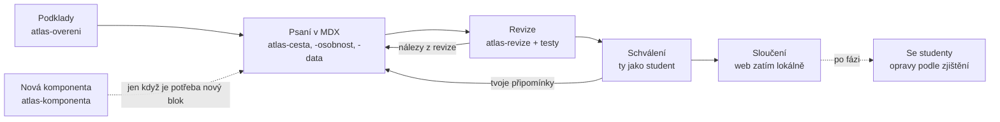

# Atlas myšlení — kritika, architektura a plán vývoje

29. 9. 2026 · Vojtěch Czempka

## Shrnutí

Současný atlas má dobré jádro (vlastní pokus před výkladem, námitka, návrat, mapa s osou), ale jako základ pro atlas celé filozofie neunese další růst. Doporučuji nepokračovat v rozšiřování `atlas-antika.html`, ale udělat restart na stejných myšlenkách: nová technologie, jednotný design a obsah postavený víc na příběhu a velkých myšlenkových pokusech.

Pět hlavních rozhodnutí, která navrhuji:

1. **Z jednoho HTML na statický web** (Astro + obsah v Markdownu/MDX + data v YAML). Pořád bez serveru a databáze; zatím běží lokálně, později ho lze zdarma zveřejnit na GitHub Pages.
2. **Příběh a velké otázky jako páteř obsahu.** Každý filozof dostane svůj skutečný příběh; cvičení vycházejí z klasických myšlenkových pokusů a situací, které teenagery opravdu zajímají, ne z administrativních školních scének.
3. **Mapa a čas pro celé dějiny:** na mapě jen ti, kdo ve zvoleném roce žijí; pod ní „řeka životů“ se vztahy učitel–žák a kamera, která se s obdobím přesouvá z Egejského moře až do Evropy a Ameriky.
4. **Deník „Moje filozofie“** jako hodnotové těžiště: student si soukromě ukládá svá stanoviska k velkým otázkám a postupně vidí vlastní myšlenkový autoportrét.
5. **Menší a lepší sada nástrojů pro vývoj:** stálá pravidla projektu v `CLAUDE.md`, sedm skillů pro opakovanou práci, prompty jen pro jednorázové kroky. Starý čtyřkrokový cyklus (scénář → interakce → implementace → revize) zkrátit na dva kroky (napsat přímo do komponent → zrevidovat).

## Kritika současného stavu

Největší problém není technika, ale tón: atlas zatím učí hlavně argumentační hygienu na vymyšlených školních případech, a příběh, krása a životní váha filozofie se z něj vytrácejí.

### Technika souboru

- **3 MB v jednom souboru, 21 tisíc řádků.** Z toho 2,2 MB tvoří dva obrázky vložené jako base64 a 0,6 MB celá knihovna ikon Lucide, i když se používá pár ikon. Vlastní logika aplikace má kolem 60 kB.
- **Data, texty, styly a kód jsou promíchané.** 27 myslitelů je jeden řádek JSONu uvnitř skriptu, texty lekcí jsou v řetězcích JavaScriptu. Každá obsahová změna znamená zásah do kódu a v gitu je nečitelný rozdíl.
- **Není to ani skutečně samostatné:** písmo Manrope se načítá z Google Fonts, offline se tedy vzhled rozpadne (a v EU je vkládání Google Fonts i právně sporné).
- **Odpovědi po obnovení stránky mizí.** Pro domácí studium a „vrať se za pár dní“ je to zásadní nedostatek; aplikace to navíc musí studentovi vysvětlovat.
- Pro atlas s desítkami období a stovkami osobností by soubor rostl do desítek MB a práce s ním by byla pro člověka i pro AI čím dál pomalejší a chybovější.

### UI

- **Dva vizuální jazyky vedle sebe.** Profil Marca je hezký „časopisecký“ (velká patičková typografie, portrét, kapitoly). Profil Sókrata je generická karta s nadpisem „Ukázkový profil“, jiným písmem a zdvojeným nadpisem.
- **Viditelná chyba na každé stránce:** hlavní nadpis dostává programově fokus a kolem něj se kreslí silný černý rámeček.
- **Navigace se mění podle stránky:** jednou „Zpět na mapu“ v hlavičce, jinde kulaté tlačítko zpět plus drobečková navigace, jinde spodní lišta. Student nemá stálý pocit, kde je.
- **Mapa je šedá a prázdná:** moře a pevnina skoro splývají, města jsou velké bubliny, lidé se vybírají z rozbalovacího seznamu v bočním panelu. Na telefonu zabírá polovinu obrazovky prázdná plocha.
- **Osa je jen posuvník.** Životy nejsou vidět přímo pod mapou (jsou schované v bočním panelu), takže právě to, co má atlas nejlépe ukazovat (kdo žil s kým a jak daleko od sebe), není na první pohled vidět.
- **Lekce vypadají jako formulář:** textové pole, přepínače A/B/C, stránkování 1–6. Chybí obraz, scéna, atmosféra.

### Obsah a příklady

- **Příklady jsou býrokratické:** smazaný plakát ve sdílené složce, placená studijní aplikace, prodloužené přestávky, pochvala za školní projekt, sluchátka. Jsou bezpečné, ale nikoho nechytí a působí jako cvičení z kritického myšlení, ne jako filozofie.
- **Chybí skutečné příběhy, které má filozofie po ruce.** Cesta „Kdy mám dobrý důvod věřit?“ může začít věštírnou v Delfách („nikdo není moudřejší než Sókratés“), které Sókratés nevěří a jde ji prověřit. Lachétův argument o odvaze při ústupu má skvělý osobní protějšek: Alkibiadés v Symposiu líčí, jak Sókratés klidně ustupoval od Délia. Epiktétos byl otrok s chromou nohou, Diogenés řekl Alexandrovi, ať mu nestíní. To jsou vstupy, které si student zapamatuje.
- **Profily jsou tenké a nesourodé.** Marcus má 11 kapitol, Sókratés tři odstavce, Prótagorás je jen bod na mapě.
- **Hodnotový záměr (smysl života, autenticita, být lepším člověkem) se v aplikaci skoro neprojevuje.** Osobní rovina je zredukovaná na nepovinnou větu na konci.

### Plánovací dokumenty a prompty

- **Je jich příliš a jsou předělané na bezpečnost:** H01–H10, R1–R4, X1, stavy „implementováno, čeká na revizi“, desítky zákazů typu „nevytvářej“, „netvrd“, „neprezentuj“. Tahle obranná řeč pak prosakuje i do studentských textů, které se následně musí čistit (H01).
- **Čeština je kostrbatá a zhuštěná** („Neanimovat domyšlené cesty“, „Studentský text nech plynout“), místy obtížně srozumitelná i pro autora.
- **Prompty jsou psané pro jiný nástroj** (skilly v ChatGPT, modely Astra/Sol/Luna). Pro Clauda je potřeba je přepsat; samotné skilly navíc v repozitáři nejsou.
- **Workflow má zbytečné předávky:** scénář v Markdownu → specifikace interakcí → ruční přepsání do JavaScriptu → revize. Když se lekce píše rovnou z hotových komponent, dvě z těchto fází odpadají.

### README

- **Popisuje soubory, které v repozitáři nejsou:** `skills/`, `Plány hodin/`, `overeni/`, `docs/`, `AGENTS.md`. Ve skutečnosti je tam 6 souborů.
- **Místo pozvání je to provozní zápis** (import, kontrolní součty, „fiktivní git historie“). Chybí, proč projekt existuje, pro koho je, jak vypadá (snímek) a kde se dá vyzkoušet.
- **Chybí licence**, ačkoli projekt používá cizí fotografie pod CC BY. Zvolena nekomerční licence: CC BY-NC-SA 4.0 pro texty, MIT pro kód.

## Je jeden .html soubor správná volba?

Pro prototyp ano, pro atlas celé filozofie ne. Doporučuji statický web v Astru: výsledek jsou pořád obyčejné HTML stránky bez serveru, ale obsah, data a kód žijí odděleně.

| Varianta | Co získáme | Co ztratíme | Verdikt |
| --- | --- | --- | --- |
| Zůstat u jednoho HTML | Otevře se dvojklikem, jde poslat e-mailem | Roste do desítek MB, obsah zamčený v kódu, žádná kontrola dat, nečitelná historie změn | Jen pro prototyp |
| Více souborů bez sestavení (HTML + JS moduly + JSON) | Žádné nástroje | Nefunguje z disku (prohlížeč blokuje načítání JSON přes file://), žádné šablony stránek, vše ručně | Polovičaté |
| **Astro, statický web** | Obsah v Markdownu/MDX, data v YAML se schématem, každá stránka má vlastní adresu, interaktivní prvky jen tam, kde jsou potřeba, rychlé na telefonu | Je potřeba `npm run build` (udělá za tebe GitHub automaticky) | **Doporučuji** |
| Webová aplikace se serverem a účty | Synchronizace mezi zařízeními, třídy | Provoz, náklady, GDPR u nezletilých, údržba | Zatím ne |

Proč právě Astro:

- **Obsah jako text.** Profil Sókrata je soubor `socrates.mdx`, který se čte jako článek. Do něj se vkládají komponenty jako `<Volba>`, `<Odkryj>`, `<Pribeh>`. Lekci tak lze napsat rovnou v konečné podobě.
- **Obsahový kontrakt hlídá stroj.** Každý typ obsahu (osobnost, směr, pojem…) má schéma; chybějící rok úmrtí nebo odkaz na neexistující osobu zastaví sestavení dřív, než se dostane ke studentům.
- **Rychlost a dostupnost:** stránky jsou předpočítané, JavaScript se načítá jen pro mapu a cvičení. Offline režim (PWA) umožní atlas „nainstalovat“ na telefon.
- **Dobře se s ním pracuje v Claude Code:** malé soubory, jasná struktura, čitelné rozdíly v gitu.
- **Lokálně i veřejně:** zatím se spouští na tvém počítači příkazem `npm run dev`; zveřejnění na GitHub Pages je později jedno nastavení.

Další technické volby: interaktivní prvky ve Svelte (malé a čitelné komponenty), mapa přes d3-geo nad daty Natural Earth, vyhledávání Pagefind (statické, bez serveru), obrázky přes obrazovou pipeline Astra (automaticky zmenšené AVIF/WebP), písma uložená lokálně, ikony jen ty použité. Postup studenta a deník v prohlížeči (localStorage) s exportem do souboru, aby si je mohl přenést bez registrace.

## Pedagogické pilíře

Atlas má studenta nejdřív zaujmout člověkem a otázkou, pak ho nechat myslet sám a teprve potom mu dát filozofovu odpověď. Z dosavadní koncepce přebírám logiku „vlastní pokus → setkání → náraz → nový pokus → návrat“; přidávám příběh, praxi a osobní deník.

| Pilíř | Co to znamená v atlasu | Příklad |
| --- | --- | --- |
| Příběh před pojmem | Každá osobnost i cesta začíná scénou ze skutečného života. Tradovaný příběh se vypráví jako příběh, bez připojených výhrad. | Thálés spadne do studny, protože se dívá na hvězdy; jindy předpoví úrodu oliv, pronajme všechny lisy a zbohatne. |
| Otázka, která se mě týká | Každý celek stojí na velké otázce, kterou si šestnáctiletý člověk opravdu kláde: strach, přátelství, své já, svoboda, smrt, spravedlnost, láska. | „Jsem pořád týž člověk, když se měním?“ (Théseova loď, Hérakleitova řeka) |
| Nejdřív sám | Před každým výkladem vlastní odhad nebo volba s důvodem. Odpověď se odkrývá až po pokusu. | „Co bys udělal s Gygéovým prstenem neviditelnosti?“, až pak Platonův Glaukón. |
| Nejsilnější verze druhého | Protivník dostává nejlepší možný argument. To je i hodnotová výchova: naslouchat, ne vyhrávat. | Prótagorás není „lhavý sofista“, ale učitel, který má v demokracii silný důvod učit mluvit. |
| Zkus to žít | Antičtí filozofové chápali filozofii jako způsob života. Každý směr nabídne dobrovolný týdenní experiment. | Stoické večerní ohlédnutí za dnem; epikurejské roztřídění vlastních tužeb; jeden sokratovský rozhovor s kamarádem. |
| Moje filozofie | Soukromý deník, kde si student ukládá svá stanoviska k velkým otázkám a může je měnit. Nic se neboduje. | Na konci antiky vidí: „V otázce dobrého života máš blízko k Epikúrovi, v otázce odvahy ke stoikům.“ |
| Souvislosti v čase | Každý člověk je vidět na mapě a ose: s kým žil, od koho se učil, kdo na něj navazoval. | Od Sókratovy smrti po narození Marca Aurelia uplynulo přes 500 let, sedm až osm lidských životů. |
| Návrat | Krátké vybavování po několika dnech, bez nápovědy, na novém případu. | „Vzpomeň si: co nemáme ve své moci podle Epiktéta? Použij to na tuhle situaci.“ |

Co zůstává z původní koncepce beze změny: zpětná vazba hodnotí důvody, nikdy souhlas s filozofem; osobní odpovědi jsou dobrovolné; aplikace nepředstírá, že rozumí volnému textu (student porovnává s modelovými odpověďmi). Filozofie se nesmí změnit jen v rady do života; poznání, skutečnost, jazyk a společnost dostanou stejný prostor jako etika.

## Informační architektura a typy stránek

Atlas má pět stálých vstupů v hlavní navigaci (Domů, Mapa a čas, Otázky, Lidé a směry, Můj deník) a jedenáct typů stránek, které sdílejí stejné stavební bloky. Vyhledávání, tmavý režim a režim pro třídu jsou dostupné odkudkoli.

| Typ stránky | Adresa (příklad) | Hlavní úloha | Z čeho se skládá |
| --- | --- | --- | --- |
| Domů | `/` | Pozvat k otázce, nabídnout jeden jasný začátek a pokračování | Velká otázka, doporučená cesta, tři vstupy, „Pokračuj“, Příběh týdne |
| Mapa a čas | `/mapa?rok=-430` | Orientace: kdo kdy žil, kde a s kým | Mapa, řeka životů, období, karta osobnosti |
| Období | `/obdobi/antika` | Svět, ve kterém se takto myslelo | Úvodní scéna, co se dělo ve světě, otázky doby, lidé a směry, osa |
| Osobnost | `/osobnost/socrates` | Člověk, jeho příběh a myšlenky | Viz šablona níže |
| Směr | `/smer/stoicismus` | Společné jádro, vývoj a rozdíly uvnitř | Založení, 3 hlavní myšlenky, rodokmen učitelů a žáků, spor s jiným směrem, „Zkus to žít“ |
| Velká otázka | `/otazka/jak-zit` | Rozhovor napříč staletími | Otázka, tvůj první názor, odpovědi filozofů na časové ose, cesty k této otázce, zápis do deníku |
| Cesta | `/cesta/kdy-mam-dobry-duvod-verit/1` | 15–20 minut vedeného průchodu | Kroky z interaktivních bloků, zpětná vazba, závěr, návrat |
| Myšlenkový pokus | `/pokus/gyguv-prsten` | Jedna situace, kterou lze měnit a znovu posoudit | Scéna, volba, změna podmínky, co řekli filozofové |
| Pojem | `/pojem/ataraxia` | Krátké vysvětlení jednoho slova | Definice lidsky, původ slova, příklad, kde se objevuje; také jako vyskakovací bublina v textu |
| Můj deník | `/denik` | Soukromý prostor studenta | Moje stanoviska, rozepsané cesty, návraty, sbírka potkaných filozofů, export |
| Náboženství | /nabozenstvi/buddhismus | Úvod do religionistiky podle RVP G | Příběh vzniku, hlavní myšlenky a praxe, šíření na mapě, vazby na filozofy a otázku 9 |

### Šablona osobnosti ve třech hloubkách

Stovky lidí nemohou mít profil jako Marcus. Proto tři úrovně, všechny ze stejné šablony:

- **Medailonek** (všichni na mapě): jméno, roky, místa, směr, jedna věta „kdo to byl“, jedna věta „proč si ho pamatujeme“, vazby. Vzniká z dat.
- **Profil** (důležité osobnosti období): navíc příběh, 1–2 hlavní myšlenky s vlastním pokusem, úryvek s otázkou.
- **Portrét** (klíčové postavy, 1–3 na období): celý příběh v kapitolách jako dnes Marcus, myšlenkový pokus, „Zkus to žít“, kdo na něj navazoval.

Pořadí bloků na stránce: hlavička (jméno, roky, portrét, jedna věta) → příběh → doba a lidé (automaticky: mini osa se současníky, učitelé a žáci, výřez mapy) → velké myšlenky → hlas (úryvek) → zkus to žít → kdo navazoval → kam dál. Blok „Doba a lidé“ se generuje z dat, takže se nikdy nepíše ručně a nemůže se rozejít s mapou.

Adresy budou skutečné cesty (`/osobnost/socrates/`) místo dnešních `#osobnost/socrates`. Stará verze nebyla zveřejněná, takže staré adresy není nutné zachovávat.

## Mechanismy učení a obsahová složka

Všechny cesty, profily i otázky se skládají z jedné knihovny asi dvanácti interaktivních bloků. Každý blok se naprogramuje jednou a autor ho pak jen vkládá do textu, podobně jako obrázek.

| Blok | Co student dělá | K čemu slouží |
| --- | --- | --- |
| Příběh | Čte krátkou scénu s obrazem (později i poslech) | Zaujmout, zasadit do doby |
| Volba s důvodem | Vybere možnost a připiše proč; ke každé možnosti vlastní zpětná vazba | Odhalit vlastní předpoklad |
| Odkryj | Napíše vlastní pokus, pak odkryje modelové odpovědi a sebekontrolu | Učit se z vlastního pokusu |
| Roztřiď | Třídí karty do košů přetažením, klepnutím nebo klávesnicí a smí přidat vlastní; ke kartám pak dostane otázky | Vyzkoušet filozofovo rozlišení na vlastních věcech |
| Změň jednu věc | Přepíná podmínku myšlenkového pokusu a znovu rozhoduje | Uvidět hranici principu |
| Dialog | Vede sokratovský rozhovor: vybírá odpovědi, filozof se ptá dál, rozhovor se větví | Zažít filozofii jako rozhovor (scénář psaný předem, bez AI) |
| Spor | Postaví se na škálu mezi dva filozofy, pak si přečte jejich nejsilnější argumenty a může se přesunout | Srovnat dvě odpovědi, změnit názor s důvodem |
| Úryvek s otázkou | Označí v textu větu, která odpovídá na otázku | Vlastní čtení pramene |
| Slož argument | Seřadí premisy a závěr, najde skrytý předpoklad | Vidět stavbu myšlenky |
| Kdo žil dřív? | Odhadne pořadí nebo vzdálenost dvou lidí, pak se otevře osa | Propojit učení s mapou a časem |
| Kdo to řekl? | Přiřadí výrok k filozofovi | Rychlé opakování, hra |
| Návrat | Po několika dnech vybaví princip a použije ho na nový případ | Dlouhodobé zapamatování |
| Zkus to žít | Vezme si týdenní výzvu, později zapíše, jak dopadla | Filozofie jako způsob života |
| Moje stanovisko | Zapíše do deníku, kde stojí u velké otázky a proč | Autenticita, vlastní myšlenkový profil |

### Motivace bez manipulace

- **Sbírka setkání:** po dokončení profilu nebo cesty získá student kartu filozofa do deníku; mapa postupně „barevní“ tam, kde už byl.
- **Žádné žebříčky, série dní ani body za názor.** Odpovídají hodnotám projektu a nevytvářejí tlak.
- **„Pokračuj, kde jsi skončil“** na úvodní stránce a upozornění na návraty, které už čekají.

### Obsahová složka

Krátké formáty, které lze číst samostatně a sdílet, ale vždy vedou zpět do atlasu:

- **Příběh týdne** (2 minuty čtení) na úvodní stránce, z archivu příběhů.
- **Myšlenkový pokus** jako samostatná stránka s volbou; ideální na začátek hodiny.
- **Filozof za minutu:** krátká karta s příběhem, jednou myšlenkou a otázkou.
- **Kartičky ke sdílení:** citát nebo otázka jako obrázek pro Instagram či WhatsApp, generovaný přímo z atlasu.
- **Později:** namluvené příběhy s přepisem a scénáře krátkých videí, které může učitel natočit.

### Doma i ve třídě

Tentýž obsah má přepínač **Režim třídy**: větší písmo, jeden podnět na obrazovce, zpětná vazba se odkrývá až na pokyn učitele a QR kód, kterým si studenti otevřou stejný krok na telefonu. Doma funguje stejná stránka jako samostudium.

## Mapa a čas pro celé dějiny

Mapa a osa budou jeden nástroj: nahoře mapa, pod ní „řeka životů“ a mezi nimi posuvník roku. Na mapě je jen ten, kdo ve zvoleném roce žije; na řece jsou vidět celé životy, takže je na první pohled zřejmé, kdo žil s kým, kdo po kom a jak daleko od sebe.

### Co bude umět

- **Jen žijící:** osoba je na mapě od roku narození do roku úmrtí včetně. Rok nula neexistuje (po 1 př. n. l. následuje 1 n. l.). Vybraný člověk, který zemře, z mapy zmizí a karta se zavře s krátkou zprávou „Sókratés zemřel roku 399 př. n. l.“
- **Volitelný „stín odkazu“:** přepínač, který ukáže zesnulé jako vybledlé body, dokud na ně někdo žijící přímo navazuje. Výchozí stav je vypnutý.
- **Řeka životů:** vodorovné pruhy životů barevně podle směru, svislá čára zvoleného roku, oblouky učitel → žák. Kliknutí na pruh vybere člověka i na mapě.
- **Změř vzdálenost:** vyber dva lidi a atlas řekne „Žili současně 14 let“ nebo „Dělí je 519 let, asi sedm lidských životů“.
- **Kamera podle období:** každé období má vlastní výřez mapy a časové okno; při posunu roku se mapa plynule přesune. Přehledový pruh celých 2 600 let s hustotou myslitelů umožní rychlý skok.
- **Typy vztahů:** učitel a žák, osobně se znali, četl a navazoval, polemizoval. Každý typ má jinou čáru, aby mapa netvrdila setkání tam, kde byl jen vliv přes knihy.
- **Místa s rolí a časem:** narození, působení, exil, smrt; kde známe roky pobytu, mapa ukáže, kde člověk v daném roce byl (Aristotelés: Stageira → Athény → Assos → Makedonie → Athény → Chalkis).
- **Dějinné události:** pár kotev na období (Peloponnéská válka, Alexandrova tažení, pád Západořímské říše, reformace, Francouzská revoluce), aby filozofie nevisela ve vzduchoprázdnu.
- **„Mezitím jinde“ (později):** okno do Indie a Číny. Konfucius a Buddha žili ve stejné době jako Hérakleitos a Parmenidés; pro studenty silný moment.

### Období a výřezy mapy

| Období | Přibližné okno | Výřez mapy |
| --- | --- | --- |
| Počátky a klasické Řecko | 650–300 př. n. l. | Egejské moře, Iónie, jižní Itálie |
| Helenismus a Řím | 350 př. n. l. – 550 n. l. | Středomoří |
| Středověk (křesťanský, islámský, židovský) | 400–1450 | Evropa, Blízký východ, severní Afrika, Al-Andalus |
| Renesance a raný novověk | 1400–1700 | Evropa |
| Osvícenství | 1680–1800 | Západní a střední Evropa |
| 19. století | 1780–1900 | Evropa |
| 20. století a současnost | 1880–2026 | Evropa a Severní Amerika, postupně svět |

Na telefonu: mapa nahoře, řeka v dolním vysouvacím panelu, karta člověka jako spodní list. Na notebooku musí být mapa, posuvník i řeka vidět současně bez posouvání stránky.

Ukázka pro rok 360 př. n. l.:

| Myslitel | Žil | Na mapě v roce 360 př. n. l. |
| --- | --- | --- |
| Sókratés | 469–399 př. n. l. | ne, 39 let po smrti |
| Démokritos | 460–370 př. n. l. | ne, 10 let po smrti |
| Platón | 427–347 př. n. l. | ano |
| Diogenés | 412–323 př. n. l. | ano |
| Aristotelés | 384–322 př. n. l. | ano |
| Epikúros | 341–270 př. n. l. | ne, narodí se za 19 let |
| Zénón z Kitia | 334–262 př. n. l. | ne, narodí se za 26 let |

Ukázka principu na skutečných datech: posuvník roku je čárkovaná čára, zvýrazněné pruhy jsou lidé, které mapa právě ukazuje.

## Vizuální jazyk a UI

Základem bude časopisecký styl, který už má profil Marca Aurelia, dotažený do jednotného systému pro všechny stránky: klidný papírový podklad, silná patičková typografie, velké obrazy a jedna barva pro každé období.

| Prvek | Návrh | Proč |
| --- | --- | --- |
| Písmo | Literata nebo Newsreader pro nadpisy a čtení, Inter pro ovládání; uložené lokálně | Plná podpora češtiny, dobrá čitelnost na telefonu, funguje offline |
| Barvy | Teplý papír a téměř černý inkoust; každé období má vlastní akcent (antika terakota, středověk lapis lazuli atd.) | Barva sama říká, kde v dějinách jsem; na mapě i ose |
| Tmavý režim | Teplá tmavá varianta stejných tokenů | Čtení večer, projekce |
| Obrazy | Busty, fresky a rukopisy v jednotné úpravě (duotón v barvě období), vždy s popiskem a licencí | Sjednocený dojem z různorodých zdrojů |
| Mapa | Jemně ilustrovaná: odlišené moře, pevnina a reliéf, názvy v dobové podobě, lidé jako malé portrétní body | Mapa má lákat k průzkumu, ne působit jako schéma |
| Rozvržení | Čtenářský sloupec kolem 680 px, široké bloky pro mapu, osu a obrazy | Pohodlné čtení i na velkém monitoru |
| Navigace | Stálá hlavička (logo, 4 vstupy, hledání, deník); na telefonu spodní lišta s pěti ikonami; drobečková navigace vždy na stejném místě | Student vždy ví, kde je a jak se vrátit |
| Pohyb | Jemné přechody, kamera mapy; vypnuto při „omezit pohyb“ | Plynulost bez rozptylování |
| Přístupnost | Kontrast WCAG AA, ovládání klávesnicí, rámeček fokusu jen při použití klávesnice | Opraví i dnešní černé rámečky kolem nadpisů |

Postup: nejdřív vizuální návrh čtyř klíčových obrazovek (Domů, Mapa a čas, Osobnost, krok cesty) na notebooku i telefonu, společná iterace a schválení. Teprve potom se návrh převede do design tokenů a komponent. Barvy období a konkrétní písmo jsou návrh k odsouhlasení, ne hotová volba.

## Obsahový model a struktura repozitáře

Každý kus obsahu je jeden soubor s pevným ID a schématem; stránky se z nich skládají automaticky. Díky tomu se například současníci, učitelé a žáci na profilu nikdy nepíšou ručně.

```text
atlas/
├─ CLAUDE.md                  stálá pravidla projektu pro Clauda
├─ README.md                  proč projekt existuje, jak ho spustit, ukázka
├─ docs/                      koncepce, plán, rozhodnutí, průvodce stylem
│  └─ archiv/                 dosavadní dokumenty a atlas-antika.html (v9)
├─ ucitel/                    plány hodin a podklady mimo studentský web
├─ src/
│  ├─ content/
│  │  ├─ osobnosti/           socrates.mdx, platon.mdx …
│  │  ├─ smery/               stoicismus.mdx …
│  │  ├─ obdobi/              antika.mdx …
│  │  ├─ otazky/              jak-zit.mdx …
│  │  ├─ cesty/               kdy-mam-dobry-duvod-verit/ (kroky jako MDX)
│  │  ├─ pokusy/              gyguv-prsten.mdx …
│  │  ├─ pojmy/               ataraxia.md …
│  │  └─ pribehy/             krátké příběhy pro „Příběh týdne“
│  ├─ data/
│  │  ├─ lide.yaml            všichni myslitelé: data, místa, směr, hloubka profilu
│  │  ├─ vztahy.yaml          typované vztahy mezi lidmi
│  │  ├─ mista.yaml           souřadnice a dobové názvy
│  │  ├─ udalosti.yaml        dějinné kotvy
│  │  └─ zdroje.yaml          prameny, překlady, licence obrázků
│  ├─ components/             knihovna bloků (Volba, Odkryj, Dialog, Mapa …)
│  └─ pages/                  šablony stránek
└─ tests/                     automatické kontroly dat a průchodů
```

Ukázka záznamu v `lide.yaml`:

```yaml
- id: epiktetos
  jmeno: Epiktétos
  narozen: { rok: 55, priblizne: true }
  zemrel: { rok: 135, priblizne: true }
  smer: stoicismus
  hloubka: profil        # medailonek | profil | portret
  mista:
    - { misto: hierapolis, role: narozeni }
    - { misto: rim, role: pusobeni, od: 70, do: 93 }
    - { misto: nikopolis, role: pusobeni, od: 93 }
  kdo: Otrok, který se stal nejvlivnějším učitelem stoicismu.
  proc: Rozlišil, co je v naší moci a co ne.
```

Pravidla modelu:

- **Zdroje patří do dat, ne do vyprávění.** Každé tvrzení a citát má v datech odkaz na pramen; student vidí jen stručný údaj u citátu (autor, dílo, místo) a na konci stránky rozbalovací „Prameny“.
- **Učitelské a redakční podklady žijí ve složkách `ucitel/` a `docs/`**, nikdy ve studentském obsahu.
- **Vztah má vždy typ** (učitel, známost, vliv textem, polemika) a zdroj.
- **Automatické kontroly při každém commitu:** platná data, existující odkazy, žádný rok nula, narození před úmrtím, učitel starší než žák, každý obrázek s licencí.

## Výrobní workflow jednoho celku

Celek (jedna velká otázka s cestou a potřebnými profily) projde čtyřmi kroky a jedním lidským schválením. Nová komponenta vzniká samostatně a jen tehdy, když ji obsah opravdu potřebuje.



1. **Podklady** (skill `atlas-overeni`): rešerše příběhů, dat, citátů a překladů; výsledkem je podkladový list v `docs/podklady/`, kde každé tvrzení má zdroj. Tady se vyřeší všechny pochybnosti, aby se nemusely objevit ve studentském textu.
2. **Psaní přímo do atlasu** (skilly `atlas-osobnost`, `atlas-cesta`, `atlas-data`): text se píše rovnou jako MDX s komponentami, data do YAML. Hned je vidět náhled v prohlížeči; odpadá samostatný scénář i specifikace interakcí.
3. **Revize** (skill `atlas-revize`): filozofická přesnost, síla námitek, didaktika, čeština a tón, průchod v prohlížeči na telefonu i notebooku. Automatické kontroly běží v GitHubu samy.
4. **Tvoje schválení:** přečteš si celek jako student (15–20 minut) a buď schválíš, nebo označíš, co nesedí. Tohle je jediný povinný lidský krok v každém celku.
5. **Sloučení:** po závěrečné revizi a schválení se větev celku sloučí do hlavní větve a hlavní větev se pošle na GitHub (stálý pokyn autora z 2. 10. 2026); mezi tím se na GitHub nic neposílá. Web zatím běží lokálně.

Vyzkoušení se studenty se dělá po obdobích, ne po každém celku: na konci každé fáze jedna skutečná hodina nebo několik domácích průchodů a oprava podle zjištění. Pro závěrečnou práci je právě tohle nejcennější doklad.

Zásadní rozhodnutí (technologie, změna šablony, nový typ stránky) se zapisují krátce do `docs/rozhodnuti.md`, aby se o nich nemuselo znovu diskutovat v každé konverzaci.

## Sada skillů a CLAUDE.md

Stálá pravidla patří do `CLAUDE.md` v repozitáři (Claude Code si ho načte sám při každé práci), opakované postupy do sedmi skillů a jednorázové kroky do promptů. Zdrojová verze skillů je v repozitáři ve složce `skills/`, takže se verzují spolu s projektem; používají se uložené v účtu Claude (nebo zkopírované do `.claude/skills/`).

### CLAUDE.md: ústava projektu

- Záměr v pěti větách a publikum (středoškoláci 15–19 let, samostudium i třída).
- **Tón hlasu:** přímo, živě, s příběhem; žádné redakční poznámky, výhrady k vlastní práci ani metodické popisky ve studentském textu. Tradovaný příběh se uvede „Vypráví se, že…“, vymyšlená současná situace „Představ si…“. Filozofická pochybnost a námitky zůstávají, jsou obsahem.
- **České konvence:** přepis řeckých jmen s délkami (Sókratés, Platón, Aristotelés, Epikúros), letopočty „399 př. n. l.“, české uvozovky, oslovení studenta tykáním.
- Struktura repozitáře, příkazy (`npm run dev`, `build`, `test`), definice hotového celku.
- Co do atlasu nepatří: žebříčky, hodnocení názorů, vymyšlené citáty skutečných lidí, učitelské poznámky.
- Odkaz na skilly a na `docs/styl.md` s ukázkami dobrého a špatného textu.

### Sedm skillů

| Skill | Kdy se použije | Co obsahuje | Kdy vznikne |
| --- | --- | --- | --- |
| `atlas-overeni` | Před psaním každého obsahu a při kontrole citátů | Postup rešerše, spolehlivé zdroje (SEP, IEP, Diogenés Laertios, české překlady), jak poznat podvržený citát, šablona podkladového listu | Vlna 1, hned |
| `atlas-revize` | Po každém celku a před zveřejněním | Kontrolní seznam: filozofie, didaktika, tón, UX; formát nálezů podle dopadu; kdy rovnou opravit | Vlna 1, hned |
| `atlas-komponenta` | Nový interaktivní blok nebo změna UI | Design tokeny, vzor komponenty, přístupnost, testy v Playwrightu, snímky v obou režimech | Vlna 2, po design systému |
| `atlas-cesta` | Nová cesta, stránka velké otázky, myšlenkový pokus | Stavební logika cesty, knihovna bloků s příklady použití, jak psát zpětnou vazbu a modelové odpovědi, měřítko dobrého příkladu | Vlna 2, po první hotové cestě |
| `atlas-osobnost` | Profil osobnosti, stránka směru, pojem | Tři hloubky profilu, jak najít a vyprávět příběh, výběr 1–3 myšlenek, blok „Zkus to žít“, ukázkový portrét | Vlna 2, po prvním novém portrétu |
| `atlas-data` | Hromadné přidání lidí, míst, vztahů a událostí | Schéma, pravidla pro přibližná data a souřadnice, typy vztahů, kontroly | Vlna 2 |
| `atlas-obdobi` | Plánování nového období (asi osmkrát za projekt) | Výběr lidí a hloubek, velké otázky doby, výřez mapy, dějinné kotvy, pořadí celků | Vlna 3, po dokončení antiky |

Proti dosavadní pětici: `atlas-koncepce` nahrazuje CLAUDE.md a skill `atlas-obdobi`; `atlas-lekce` se dělí na `atlas-cesta` a `atlas-osobnost`, protože příběh osobnosti a didaktika cesty jsou různá řemesla; `atlas-interakce` a `atlas-vyvoj` spojuje `atlas-komponenta`; přibývá `atlas-overeni` a `atlas-data`, které budou při rozšiřování na celé dějiny nejčastější.

Každý skill má krátký `SKILL.md` (postup a kritéria hotového) a 1–3 referenční soubory s ukázkami. Ukázky budou skutečné hotové stránky z atlasu, proto skilly vlny 2 vznikají až po prvním hotovém kusu. Po dokončení každé fáze se skilly upraví podle toho, co se opakovaně nepovedlo.

## Katalog promptů s modelem a úsilím

Výchozí volba je Claude Opus 5.5 s vysokým úsilím; Fable 5.1 jen pro dvě nejtěžší syntézy, Sonnet 5.5 pro dobře zadanou rutinu a Haiku 4.5 jen pro mechanické úpravy. Plné znění promptů je v plánech větví (`docs/plany/`), rozcestník je pod tabulkou.

| Model | Silná stránka | Kdy ho použít v atlasu |
| --- | --- | --- |
| Fable 5.1 | Nejhlubší uvažování, dlouhé složité úlohy | Architektura celé filozofie, souhrnná revize období |
| Opus 5.5 | Dlouhá samostatná práce v kódu i textu, kvalitní čeština | Většina práce: design, kód, příběhy, cesty, revize |
| Sonnet 5.5 | Rychlost a spolehlivost u jasně zadaných úkolů | Hromadná data, medailonky podle vzoru, ověřování faktů, CI |
| Haiku 4.5 | Nejrychlejší; znalosti jen do února 2025, slabší stylistika v češtině | Překlepy, formátování, přejmenování; nikdy fakta ani nový text |

Úsilí má pět stupňů: low, medium, high, xhigh, max. U Opusu 5.5 je výchozí medium, proto ho pro atlas většinou zvedni na high; xhigh použij na dlouhou implementaci nebo zaseknutý problém, max jen výjimečně. Práci v repozitáři spúuštěj v Claude Code nebo v Coworku s připojenou složkou; debatu nad koncepcí klidně v běžném chatu.

| Prompt | Krok | Model · úsilí | Proč tento model | Stav |
| --- | --- | --- | --- | --- |
| P0 | Základ: archiv, README, CLAUDE.md, styl, skilly vlny 1 | Opus 5.5 · high | Pravidla projektu ovlivní vše další | Hotovo 29. 9. 2026 |
| P1 | Vizuální návrh čtyř obrazovek | Opus 5.5 · high | Vkus, konzistence a práce s českou typografií | Hotovo 29. 9. 2026, `docs/design.md` |
| P2 | Založení projektu v Astru a přenos dat | Opus 5.5 · high (xhigh při zaseknutí) | Dlouhá souvislá implementace s ověřením | Hotovo 29. 9. 2026, schváleno 30. 9. 2026 (brána F1) |
| P3 | Architektura celé filozofie: období, velké otázky, klíčové osobnosti | Fable 5.1 · high | Jednorázová syntéza 2 600 let s dopadem na celou navigaci | Hotovo 29. 9. 2026, `docs/architektura.md` |
| P4 | Mapa a čas v2 | Opus 5.5 · high (xhigh při zaseknutí) | Hraniční případy času, výkon a mobilní rozvržení | Hotovo a schváleno 30. 9. 2026 |
| P5 | Knihovna bloků, prvních šest | Opus 5.5 · high (xhigh při zaseknutí) | Základ všech cest, musí být přístupný a testovaný | Hotovo a schváleno 1. 10. 2026 (s ukázkovou cestou 1) |
| P6 | Podklady k celku | Sonnet 5.5 · high s vyhledáváním; Opus 5.5 · high u sporných pramenů | Systematická rešerše, ověření každého tvrzení | Celek 1 a celek 2 hotovo a schváleno; celek 3 je další krok (`docs/plany/celek-3.md`) |
| P7 | Portrét nebo profil osobnosti | Opus 5.5 · medium, high u portrétu | Příběh a živá čeština | Celek 1 a celek 2 hotovo a schváleno; skill `atlas-osobnost` |
| P8 | Cesta, velká otázka, myšlenkový pokus | Opus 5.5 · high | Spojení filozofie, didaktiky a příběhu | Celek 1 a celek 2 hotovo a schváleno; skill `atlas-cesta` |
| P9 | Medailonky a data hromadně | Sonnet 5.5 · medium | Vyplňování podle vzoru a schématu | Se skillem `atlas-data` |
| P10 | Revize celku | Opus 5.5 · high | Najde slabou námitku i nefunkční krok | Celek 1 hotovo a schváleno 1. 10. 2026; celek 2 hotovo a schváleno 2. 10. 2026 (`docs/plany/celek-2.md`) |
| P11 | Souhrnná revize období | Fable 5.1 · high | Souvislosti napříč desítkami stránek | Na konci každé fáze |
| P12 | Plán nového období | Opus 5.5 · high | Výběr a pořadí podle hotové architektury | Se skillem `atlas-obdobi` |
| P13 | Úprava skillů po fázi | Opus 5.5 · high | Zobecnění opakovaných chyb | Na konci každé fáze |
| P14 | Drobné úpravy | Haiku 4.5 nebo Sonnet 5.5 · low | Mechanický zásah | Kdykoli |

Doporučení modelů platí pro nabídku k 29. 9. 2026 ([přehled modelů](https://platform.claude.com/docs/en/models/overview), [úrovně úsilí](https://platform.claude.com/docs/en/build-with-claude/effort)); při výrazné změně nabídky je projdu znovu.

### Plány větví

Plné znění promptů, stav kroků a „co zůstalo na později“ jsou v souboru větve ve složce `docs/plany/`. Každý celek má jeden soubor od podkladů po závěrečnou revizi; tady zůstává jen strategie, katalog a tento rozcestník. Nový celek znamená novou větev a nový soubor `docs/plany/<větev>.md`.

| Větev | Co obsahuje | Soubor | Stav |
| --- | --- | --- | --- |
| `restart`, `mapa-v2`, `bloky-v1` | Základ a kostra: P0 až P5 | `docs/plany/zaklad.md` | hotovo a schváleno |
| `celek-1` | „Jak poznám, co je pravda?“: Sókratés, Prótagorás, cesta 1, otázka 7 | `docs/plany/celek-1.md` | hotovo, sloučeno 1. 10. 2026 |
| `celek-2` | „Jak mám žít?“: Epikúros, Diogenés, cesta 6, otázka 1 | `docs/plany/celek-2.md` | hotovo, schváleno a sloučeno 2. 10. 2026; odeslání na GitHub čeká na autora |
| `celek-3` | „Co mám ve svých rukou?“: Epiktétos, Marcus Aurelius, cesta 5 | `docs/plany/celek-3.md` | další krok je P6 (podklady) |

Po závěrečné revizi a schválení celku se větev sloučí do hlavní větve a hlavní větev se pošle na GitHub. Mezi tím se na GitHub nic neposílá.

## Plán etap

Nejdřív jeden kompletní „vertikální řez“ antiky (všechny typy stránek, mapa v2, tři přepsané cesty, deník), vyzkoušený se studenty; teprve potom šíře. Termíny jsou orientační při třech pracovních sezeních týdně; rozhoduje splnění brány, ne kalendář.

| Fáze | Výstup | Brána na konci |
| --- | --- | --- |
| F0 Základ (říjen, 1 týden) | P0 a P3: archiv, README, CLAUDE.md, průvodce stylem, skilly vlny 1, architektura celé filozofie | Schválíš období, velké otázky a pravidla tónu |
| F1 Design a kostra (říjen, 2 týdny) | P1 a P2: schválený vizuální návrh, web v Astru s ověřenými daty období 1–2 a šablonou na Sókratovi, zatím lokálně | Web běží na tvém počítači a vypadá podle návrhu |
| F2 Vertikální řez antiky (listopad, 4 týdny) | Mapa a čas v2, první bloky, skilly vlny 2, stránka období, portréty Sókrata a Epiktéta, profily Platóna, Diogena a Epikúra, tři přepsané cesty, dvě velké otázky, deník | Vyzkoušeno se studenty a opraveno; doklad pro závěrečnou práci |
| F3 Celá antika (prosinec až leden) | Předsókratici, Platón, Aristotelés, helenismus, Řím; skill `atlas-obdobi` | Souhrnná revize období (P11) |
| F4 Další období (2027) | Středověk, renesance, novověk, osvícenství, 19. a 20. století, současnost; každé jako jeden cyklus | U každého období revize a jedna skutečná hodina |
| F5 Obsahová vrstva (průběžně od F3) | Příběh týdne, kartičky ke sdílení, režim třídy, později audio | Používáno ve výuce |

Pro závěrečnou práci pedagogického minima je klíčová fáze F2: hotový, vyzkoušený a zdokumentovaný řez antiky je silnější doklad než rozsah. Plánování konkrétních hodin nechávám na dobu po F2, jak jsi chtěl.

Do odevzdání zbývá víc než rok, takže termíny nejsou napjaté: F0–F3 (celá antika) zhruba do konce ledna 2027, potom jedno období za 6–8 týdnů. Do podzimu 2027 tak může být hotová celá páteř od antiky po současnost a zbyde čas na opakované zkoušení se studenty.

## Rozhodnutí, která potřebuji od tebe

Rozhodnuto 29. 9. 2026; všech pět rozhodnutí je promítnutých do plánu výše a zapsaných v `docs/rozhodnuti.md`.

| Otázka | Rozhodnutí | Co to mění |
| --- | --- | --- |
| Restart na Astru | Ano | Dnešní soubor jde do `docs/archiv/` jako v9 |
| Podoba odevzdání závěrečné práce | Není předepsána | Offline export se nedoplňuje |
| Veřejné nasazení | Zatím jen lokálně | F1 končí webem běžícím na tvém počítači; zkoušení se studenty ve F2 na tvém notebooku, zveřejnění rozhodneme před ním |
| Rozsah tradic | Západní filozofie jako páteř, okna do dalších tradic | Platí pro P3 a plány období |
| Licence | Nekomerční: texty CC BY-NC-SA 4.0, kód MIT | Jiní učitelé mohou atlas používat a upravovat, ne ho prodávat |

P0 proběhl ve složce Atlas na tvém Macu; tento plán je uložený jako `docs/plan.md`.
