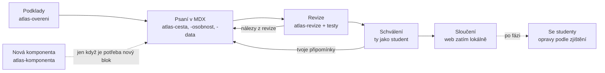

# Atlas myšlení — kritika, architektura a plán vývoje

29. 9. 2026 · Vojtěch Czempka

## Shrnutí

Současný atlas má dobré jádro (vlastní pokus před výkladem, námitka, návrat, mapa s osou), ale jako základ pro atlas celé filozofie neunese další růst. Doporučuji nepokračovat v rozšiřování `atlas-antika.html`, ale udělat restart na stejných myšlenkách: nová technologie, jednotný design a obsah postavený víc na příběhu a velkých myšlenkových pokusech.

Pět hlavních rozhodnutí, která navrhuji:

1. **Z jednoho HTML na statický web** (Astro + obsah v Markdownu/MDX + data v YAML). Pořád bez serveru a databáze; zatím běží lokálně, později ho lze zdarma zveřejnit na GitHub Pages.
2. **Příběh a velké otázky jako páteř obsahu.** Každý filozof dostane svůj skutečný příběh; cvičení vycházejí z klasických myšlenkových pokusů a situací, které teenagery opravdu zajímají, ne z administrativních školních scének.
3. **Mapa a čas pro celé dějiny:** na mapě jen ti, kdo ve zvoleném roce žijí; pod ní „řeka životů“ se vztahy učitel–žák a kamera, která se s obdobím přesouvá z Egejského moře až do Evropy a Ameriky.
4. **Deník „Moje filozofie“** jako hodnotové těžiště: student si soukromě ukládá svá stanoviska k velkým otázkám a postupně vidí vlastní myšlenkový autoportrét.
5. **Menší a lepší sada nástrojů pro vývoj:** stálá pravidla projektu v `CLAUDE.md`, sedm skillů pro opakovanou práci, prompty jen pro jednorázové kroky. Starý čtyřkrokový cyklus (scénář → interakce → implementace → revize) zkrátit na dva kroky (napsat přímo do komponent → zrevidovat).

## Kritika současného stavu

Největší problém není technika, ale tón: atlas zatím učí hlavně argumentační hygienu na vymyšlených školních případech, a příběh, krása a životní váha filozofie se z něj vytrácejí.

### Technika souboru

- **3 MB v jednom souboru, 21 tisíc řádků.** Z toho 2,2 MB tvoří dva obrázky vložené jako base64 a 0,6 MB celá knihovna ikon Lucide, i když se používá pár ikon. Vlastní logika aplikace má kolem 60 kB.
- **Data, texty, styly a kód jsou promíchané.** 27 myslitelů je jeden řádek JSONu uvnitř skriptu, texty lekcí jsou v řetězcích JavaScriptu. Každá obsahová změna znamená zásah do kódu a v gitu je nečitelný rozdíl.
- **Není to ani skutečně samostatné:** písmo Manrope se načítá z Google Fonts, offline se tedy vzhled rozpadne (a v EU je vkládání Google Fonts i právně sporné).
- **Odpovědi po obnovení stránky mizí.** Pro domácí studium a „vrať se za pár dní“ je to zásadní nedostatek; aplikace to navíc musí studentovi vysvětlovat.
- Pro atlas s desítkami období a stovkami osobností by soubor rostl do desítek MB a práce s ním by byla pro člověka i pro AI čím dál pomalejší a chybovější.

### UI

- **Dva vizuální jazyky vedle sebe.** Profil Marca je hezký „časopisecký“ (velká patičková typografie, portrét, kapitoly). Profil Sókrata je generická karta s nadpisem „Ukázkový profil“, jiným písmem a zdvojeným nadpisem.
- **Viditelná chyba na každé stránce:** hlavní nadpis dostává programově fokus a kolem něj se kreslí silný černý rámeček.
- **Navigace se mění podle stránky:** jednou „Zpět na mapu“ v hlavičce, jinde kulaté tlačítko zpět plus drobečková navigace, jinde spodní lišta. Student nemá stálý pocit, kde je.
- **Mapa je šedá a prázdná:** moře a pevnina skoro splývají, města jsou velké bubliny, lidé se vybírají z rozbalovacího seznamu v bočním panelu. Na telefonu zabírá polovinu obrazovky prázdná plocha.
- **Osa je jen posuvník.** Životy nejsou vidět přímo pod mapou (jsou schované v bočním panelu), takže právě to, co má atlas nejlépe ukazovat (kdo žil s kým a jak daleko od sebe), není na první pohled vidět.
- **Lekce vypadají jako formulář:** textové pole, přepínače A/B/C, stránkování 1–6. Chybí obraz, scéna, atmosféra.

### Obsah a příklady

- **Příklady jsou býrokratické:** smazaný plakát ve sdílené složce, placená studijní aplikace, prodloužené přestávky, pochvala za školní projekt, sluchátka. Jsou bezpečné, ale nikoho nechytí a působí jako cvičení z kritického myšlení, ne jako filozofie.
- **Chybí skutečné příběhy, které má filozofie po ruce.** Cesta „Kdy mám dobrý důvod věřit?“ může začít věštírnou v Delfách („nikdo není moudřejší než Sókratés“), které Sókratés nevěří a jde ji prověřit. Lachétův argument o odvaze při ústupu má skvělý osobní protějšek: Alkibiadés v Symposiu líčí, jak Sókratés klidně ustupoval od Délia. Epiktétos byl otrok s chromou nohou, Diogenés řekl Alexandrovi, ať mu nestíní. To jsou vstupy, které si student zapamatuje.
- **Profily jsou tenké a nesourodé.** Marcus má 11 kapitol, Sókratés tři odstavce, Prótagorás je jen bod na mapě.
- **Hodnotový záměr (smysl života, autenticita, být lepším člověkem) se v aplikaci skoro neprojevuje.** Osobní rovina je zredukovaná na nepovinnou větu na konci.

### Plánovací dokumenty a prompty

- **Je jich příliš a jsou předělané na bezpečnost:** H01–H10, R1–R4, X1, stavy „implementováno, čeká na revizi“, desítky zákazů typu „nevytvářej“, „netvrd“, „neprezentuj“. Tahle obranná řeč pak prosakuje i do studentských textů, které se následně musí čistit (H01).
- **Čeština je kostrbatá a zhuštěná** („Neanimovat domyšlené cesty“, „Studentský text nech plynout“), místy obtížně srozumitelná i pro autora.
- **Prompty jsou psané pro jiný nástroj** (skilly v ChatGPT, modely Astra/Sol/Luna). Pro Clauda je potřeba je přepsat; samotné skilly navíc v repozitáři nejsou.
- **Workflow má zbytečné předávky:** scénář v Markdownu → specifikace interakcí → ruční přepsání do JavaScriptu → revize. Když se lekce píše rovnou z hotových komponent, dvě z těchto fází odpadají.

### README

- **Popisuje soubory, které v repozitáři nejsou:** `skills/`, `Plány hodin/`, `overeni/`, `docs/`, `AGENTS.md`. Ve skutečnosti je tam 6 souborů.
- **Místo pozvání je to provozní zápis** (import, kontrolní součty, „fiktivní git historie“). Chybí, proč projekt existuje, pro koho je, jak vypadá (snímek) a kde se dá vyzkoušet.
- **Chybí licence**, ačkoli projekt používá cizí fotografie pod CC BY. Zvolena nekomerční licence: CC BY-NC-SA 4.0 pro texty, MIT pro kód.

## Je jeden .html soubor správná volba?

Pro prototyp ano, pro atlas celé filozofie ne. Doporučuji statický web v Astru: výsledek jsou pořád obyčejné HTML stránky bez serveru, ale obsah, data a kód žijí odděleně.

| Varianta | Co získáme | Co ztratíme | Verdikt |
| --- | --- | --- | --- |
| Zůstat u jednoho HTML | Otevře se dvojklikem, jde poslat e-mailem | Roste do desítek MB, obsah zamčený v kódu, žádná kontrola dat, nečitelná historie změn | Jen pro prototyp |
| Více souborů bez sestavení (HTML + JS moduly + JSON) | Žádné nástroje | Nefunguje z disku (prohlížeč blokuje načítání JSON přes file://), žádné šablony stránek, vše ručně | Polovičaté |
| **Astro, statický web** | Obsah v Markdownu/MDX, data v YAML se schématem, každá stránka má vlastní adresu, interaktivní prvky jen tam, kde jsou potřeba, rychlé na telefonu | Je potřeba `npm run build` (udělá za tebe GitHub automaticky) | **Doporučuji** |
| Webová aplikace se serverem a účty | Synchronizace mezi zařízeními, třídy | Provoz, náklady, GDPR u nezletilých, údržba | Zatím ne |

Proč právě Astro:

- **Obsah jako text.** Profil Sókrata je soubor `socrates.mdx`, který se čte jako článek. Do něj se vkládají komponenty jako `<Volba>`, `<Odkryj>`, `<Pribeh>`. Lekci tak lze napsat rovnou v konečné podobě.
- **Obsahový kontrakt hlídá stroj.** Každý typ obsahu (osobnost, směr, pojem…) má schéma; chybějící rok úmrtí nebo odkaz na neexistující osobu zastaví sestavení dřív, než se dostane ke studentům.
- **Rychlost a dostupnost:** stránky jsou předpočítané, JavaScript se načítá jen pro mapu a cvičení. Offline režim (PWA) umožní atlas „nainstalovat“ na telefon.
- **Dobře se s ním pracuje v Claude Code:** malé soubory, jasná struktura, čitelné rozdíly v gitu.
- **Lokálně i veřejně:** zatím se spouští na tvém počítači příkazem `npm run dev`; zveřejnění na GitHub Pages je později jedno nastavení.

Další technické volby: interaktivní prvky ve Svelte (malé a čitelné komponenty), mapa přes d3-geo nad daty Natural Earth, vyhledávání Pagefind (statické, bez serveru), obrázky přes obrazovou pipeline Astra (automaticky zmenšené AVIF/WebP), písma uložená lokálně, ikony jen ty použité. Postup studenta a deník v prohlížeči (localStorage) s exportem do souboru, aby si je mohl přenést bez registrace.

## Pedagogické pilíře

Atlas má studenta nejdřív zaujmout člověkem a otázkou, pak ho nechat myslet sám a teprve potom mu dát filozofovu odpověď. Z dosavadní koncepce přebírám logiku „vlastní pokus → setkání → náraz → nový pokus → návrat“; přidávám příběh, praxi a osobní deník.

| Pilíř | Co to znamená v atlasu | Příklad |
| --- | --- | --- |
| Příběh před pojmem | Každá osobnost i cesta začíná scénou ze skutečného života. Tradovaný příběh se vypráví jako příběh, bez připojených výhrad. | Thálés spadne do studny, protože se dívá na hvězdy; jindy předpoví úrodu oliv, pronajme všechny lisy a zbohatne. |
| Otázka, která se mě týká | Každý celek stojí na velké otázce, kterou si šestnáctiletý člověk opravdu kláde: strach, přátelství, své já, svoboda, smrt, spravedlnost, láska. | „Jsem pořád týž člověk, když se měním?“ (Théseova loď, Hérakleitova řeka) |
| Nejdřív sám | Před každým výkladem vlastní odhad nebo volba s důvodem. Odpověď se odkrývá až po pokusu. | „Co bys udělal s Gygéovým prstenem neviditelnosti?“, až pak Platonův Glaukón. |
| Nejsilnější verze druhého | Protivník dostává nejlepší možný argument. To je i hodnotová výchova: naslouchat, ne vyhrávat. | Prótagorás není „lhavý sofista“, ale učitel, který má v demokracii silný důvod učit mluvit. |
| Zkus to žít | Antičtí filozofové chápali filozofii jako způsob života. Každý směr nabídne dobrovolný týdenní experiment. | Stoické večerní ohlédnutí za dnem; epikurejské roztřídění vlastních tužeb; jeden sokratovský rozhovor s kamarádem. |
| Moje filozofie | Soukromý deník, kde si student ukládá svá stanoviska k velkým otázkám a může je měnit. Nic se neboduje. | Na konci antiky vidí: „V otázce dobrého života máš blízko k Epikúrovi, v otázce odvahy ke stoikům.“ |
| Souvislosti v čase | Každý člověk je vidět na mapě a ose: s kým žil, od koho se učil, kdo na něj navazoval. | Od Sókratovy smrti po narození Marca Aurelia uplynulo přes 500 let, sedm až osm lidských životů. |
| Návrat | Krátké vybavování po několika dnech, bez nápovědy, na novém případu. | „Vzpomeň si: co nemáme ve své moci podle Epiktéta? Použij to na tuhle situaci.“ |

Co zůstává z původní koncepce beze změny: zpětná vazba hodnotí důvody, nikdy souhlas s filozofem; osobní odpovědi jsou dobrovolné; aplikace nepředstírá, že rozumí volnému textu (student porovnává s modelovými odpověďmi). Filozofie se nesmí změnit jen v rady do života; poznání, skutečnost, jazyk a společnost dostanou stejný prostor jako etika.

## Informační architektura a typy stránek

Atlas má pět stálých vstupů v hlavní navigaci (Domů, Mapa a čas, Otázky, Lidé a směry, Můj deník) a jedenáct typů stránek, které sdílejí stejné stavební bloky. Vyhledávání, tmavý režim a režim pro třídu jsou dostupné odkudkoli.

| Typ stránky | Adresa (příklad) | Hlavní úloha | Z čeho se skládá |
| --- | --- | --- | --- |
| Domů | `/` | Pozvat k otázce, nabídnout jeden jasný začátek a pokračování | Velká otázka, doporučená cesta, tři vstupy, „Pokračuj“, Příběh týdne |
| Mapa a čas | `/mapa?rok=-430` | Orientace: kdo kdy žil, kde a s kým | Mapa, řeka životů, období, karta osobnosti |
| Období | `/obdobi/antika` | Svět, ve kterém se takto myslelo | Úvodní scéna, co se dělo ve světě, otázky doby, lidé a směry, osa |
| Osobnost | `/osobnost/socrates` | Člověk, jeho příběh a myšlenky | Viz šablona níže |
| Směr | `/smer/stoicismus` | Společné jádro, vývoj a rozdíly uvnitř | Založení, 3 hlavní myšlenky, rodokmen učitelů a žáků, spor s jiným směrem, „Zkus to žít“ |
| Velká otázka | `/otazka/jak-zit` | Rozhovor napříč staletími | Otázka, tvůj první názor, odpovědi filozofů na časové ose, cesty k této otázce, zápis do deníku |
| Cesta | `/cesta/kdy-mam-dobry-duvod-verit/1` | 15–20 minut vedeného průchodu | Kroky z interaktivních bloků, zpětná vazba, závěr, návrat |
| Myšlenkový pokus | `/pokus/gyguv-prsten` | Jedna situace, kterou lze měnit a znovu posoudit | Scéna, volba, změna podmínky, co řekli filozofové |
| Pojem | `/pojem/ataraxia` | Krátké vysvětlení jednoho slova | Definice lidsky, původ slova, příklad, kde se objevuje; také jako vyskakovací bublina v textu |
| Můj deník | `/denik` | Soukromý prostor studenta | Moje stanoviska, rozepsané cesty, návraty, sbírka potkaných filozofů, export |
| Náboženství | /nabozenstvi/buddhismus | Úvod do religionistiky podle RVP G | Příběh vzniku, hlavní myšlenky a praxe, šíření na mapě, vazby na filozofy a otázku 9 |

### Šablona osobnosti ve třech hloubkách

Stovky lidí nemohou mít profil jako Marcus. Proto tři úrovně, všechny ze stejné šablony:

- **Medailonek** (všichni na mapě): jméno, roky, místa, směr, jedna věta „kdo to byl“, jedna věta „proč si ho pamatujeme“, vazby. Vzniká z dat.
- **Profil** (důležité osobnosti období): navíc příběh, 1–2 hlavní myšlenky s vlastním pokusem, úryvek s otázkou.
- **Portrét** (klíčové postavy, 1–3 na období): celý příběh v kapitolách jako dnes Marcus, myšlenkový pokus, „Zkus to žít“, kdo na něj navazoval.

Pořadí bloků na stránce: hlavička (jméno, roky, portrét, jedna věta) → příběh → doba a lidé (automaticky: mini osa se současníky, učitelé a žáci, výřez mapy) → velké myšlenky → hlas (úryvek) → zkus to žít → kdo navazoval → kam dál. Blok „Doba a lidé“ se generuje z dat, takže se nikdy nepíše ručně a nemůže se rozejít s mapou.

Adresy budou skutečné cesty (`/osobnost/socrates/`) místo dnešních `#osobnost/socrates`. Stará verze nebyla zveřejněná, takže staré adresy není nutné zachovávat.

## Mechanismy učení a obsahová složka

Všechny cesty, profily i otázky se skládají z jedné knihovny asi dvanácti interaktivních bloků. Každý blok se naprogramuje jednou a autor ho pak jen vkládá do textu, podobně jako obrázek.

| Blok | Co student dělá | K čemu slouží |
| --- | --- | --- |
| Příběh | Čte krátkou scénu s obrazem (později i poslech) | Zaujmout, zasadit do doby |
| Volba s důvodem | Vybere možnost a připiše proč; ke každé možnosti vlastní zpětná vazba | Odhalit vlastní předpoklad |
| Odkryj | Napíše vlastní pokus, pak odkryje modelové odpovědi a sebekontrolu | Učit se z vlastního pokusu |
| Změň jednu věc | Přepíná podmínku myšlenkového pokusu a znovu rozhoduje | Uvidět hranici principu |
| Dialog | Vede sokratovský rozhovor: vybírá odpovědi, filozof se ptá dál, rozhovor se větví | Zažít filozofii jako rozhovor (scénář psaný předem, bez AI) |
| Spor | Postaví se na škálu mezi dva filozofy, pak si přečte jejich nejsilnější argumenty a může se přesunout | Srovnat dvě odpovědi, změnit názor s důvodem |
| Úryvek s otázkou | Označí v textu větu, která odpovídá na otázku | Vlastní čtení pramene |
| Slož argument | Seřadí premisy a závěr, najde skrytý předpoklad | Vidět stavbu myšlenky |
| Kdo žil dřív? | Odhadne pořadí nebo vzdálenost dvou lidí, pak se otevře osa | Propojit učení s mapou a časem |
| Kdo to řekl? | Přiřadí výrok k filozofovi | Rychlé opakování, hra |
| Návrat | Po několika dnech vybaví princip a použije ho na nový případ | Dlouhodobé zapamatování |
| Zkus to žít | Vezme si týdenní výzvu, později zapíše, jak dopadla | Filozofie jako způsob života |
| Moje stanovisko | Zapíše do deníku, kde stojí u velké otázky a proč | Autenticita, vlastní myšlenkový profil |

### Motivace bez manipulace

- **Sbírka setkání:** po dokončení profilu nebo cesty získá student kartu filozofa do deníku; mapa postupně „barevní“ tam, kde už byl.
- **Žádné žebříčky, série dní ani body za názor.** Odpovídají hodnotám projektu a nevytvářejí tlak.
- **„Pokračuj, kde jsi skončil“** na úvodní stránce a upozornění na návraty, které už čekají.

### Obsahová složka

Krátké formáty, které lze číst samostatně a sdílet, ale vždy vedou zpět do atlasu:

- **Příběh týdne** (2 minuty čtení) na úvodní stránce, z archivu příběhů.
- **Myšlenkový pokus** jako samostatná stránka s volbou; ideální na začátek hodiny.
- **Filozof za minutu:** krátká karta s příběhem, jednou myšlenkou a otázkou.
- **Kartičky ke sdílení:** citát nebo otázka jako obrázek pro Instagram či WhatsApp, generovaný přímo z atlasu.
- **Později:** namluvené příběhy s přepisem a scénáře krátkých videí, které může učitel natočit.

### Doma i ve třídě

Tentýž obsah má přepínač **Režim třídy**: větší písmo, jeden podnět na obrazovce, zpětná vazba se odkrývá až na pokyn učitele a QR kód, kterým si studenti otevřou stejný krok na telefonu. Doma funguje stejná stránka jako samostudium.

## Mapa a čas pro celé dějiny

Mapa a osa budou jeden nástroj: nahoře mapa, pod ní „řeka životů“ a mezi nimi posuvník roku. Na mapě je jen ten, kdo ve zvoleném roce žije; na řece jsou vidět celé životy, takže je na první pohled zřejmé, kdo žil s kým, kdo po kom a jak daleko od sebe.

### Co bude umět

- **Jen žijící:** osoba je na mapě od roku narození do roku úmrtí včetně. Rok nula neexistuje (po 1 př. n. l. následuje 1 n. l.). Vybraný člověk, který zemře, z mapy zmizí a karta se zavře s krátkou zprávou „Sókratés zemřel roku 399 př. n. l.“
- **Volitelný „stín odkazu“:** přepínač, který ukáže zesnulé jako vybledlé body, dokud na ně někdo žijící přímo navazuje. Výchozí stav je vypnutý.
- **Řeka životů:** vodorovné pruhy životů barevně podle směru, svislá čára zvoleného roku, oblouky učitel → žák. Kliknutí na pruh vybere člověka i na mapě.
- **Změř vzdálenost:** vyber dva lidi a atlas řekne „Žili současně 14 let“ nebo „Dělí je 519 let, asi sedm lidských životů“.
- **Kamera podle období:** každé období má vlastní výřez mapy a časové okno; při posunu roku se mapa plynule přesune. Přehledový pruh celých 2 600 let s hustotou myslitelů umožní rychlý skok.
- **Typy vztahů:** učitel a žák, osobně se znali, četl a navazoval, polemizoval. Každý typ má jinou čáru, aby mapa netvrdila setkání tam, kde byl jen vliv přes knihy.
- **Místa s rolí a časem:** narození, působení, exil, smrt; kde známe roky pobytu, mapa ukáže, kde člověk v daném roce byl (Aristotelés: Stageira → Athény → Assos → Makedonie → Athény → Chalkis).
- **Dějinné události:** pár kotev na období (Peloponnéská válka, Alexandrova tažení, pád Západořímské říše, reformace, Francouzská revoluce), aby filozofie nevisela ve vzduchoprázdnu.
- **„Mezitím jinde“ (později):** okno do Indie a Číny. Konfucius a Buddha žili ve stejné době jako Hérakleitos a Parmenidés; pro studenty silný moment.

### Období a výřezy mapy

| Období | Přibližné okno | Výřez mapy |
| --- | --- | --- |
| Počátky a klasické Řecko | 650–300 př. n. l. | Egejské moře, Iónie, jižní Itálie |
| Helenismus a Řím | 350 př. n. l. – 550 n. l. | Středomoří |
| Středověk (křesťanský, islámský, židovský) | 400–1450 | Evropa, Blízký východ, severní Afrika, Al-Andalus |
| Renesance a raný novověk | 1400–1700 | Evropa |
| Osvícenství | 1680–1800 | Západní a střední Evropa |
| 19. století | 1780–1900 | Evropa |
| 20. století a současnost | 1880–2026 | Evropa a Severní Amerika, postupně svět |

Na telefonu: mapa nahoře, řeka v dolním vysouvacím panelu, karta člověka jako spodní list. Na notebooku musí být mapa, posuvník i řeka vidět současně bez posouvání stránky.

Ukázka pro rok 360 př. n. l.:

| Myslitel | Žil | Na mapě v roce 360 př. n. l. |
| --- | --- | --- |
| Sókratés | 469–399 př. n. l. | ne, 39 let po smrti |
| Démokritos | 460–370 př. n. l. | ne, 10 let po smrti |
| Platón | 427–347 př. n. l. | ano |
| Diogenés | 412–323 př. n. l. | ano |
| Aristotelés | 384–322 př. n. l. | ano |
| Epikúros | 341–270 př. n. l. | ne, narodí se za 19 let |
| Zénón z Kitia | 334–262 př. n. l. | ne, narodí se za 26 let |

Ukázka principu na skutečných datech: posuvník roku je čárkovaná čára, zvýrazněné pruhy jsou lidé, které mapa právě ukazuje.

## Vizuální jazyk a UI

Základem bude časopisecký styl, který už má profil Marca Aurelia, dotažený do jednotného systému pro všechny stránky: klidný papírový podklad, silná patičková typografie, velké obrazy a jedna barva pro každé období.

| Prvek | Návrh | Proč |
| --- | --- | --- |
| Písmo | Literata nebo Newsreader pro nadpisy a čtení, Inter pro ovládání; uložené lokálně | Plná podpora češtiny, dobrá čitelnost na telefonu, funguje offline |
| Barvy | Teplý papír a téměř černý inkoust; každé období má vlastní akcent (antika terakota, středověk lapis lazuli atd.) | Barva sama říká, kde v dějinách jsem; na mapě i ose |
| Tmavý režim | Teplá tmavá varianta stejných tokenů | Čtení večer, projekce |
| Obrazy | Busty, fresky a rukopisy v jednotné úpravě (duotón v barvě období), vždy s popiskem a licencí | Sjednocený dojem z různorodých zdrojů |
| Mapa | Jemně ilustrovaná: odlišené moře, pevnina a reliéf, názvy v dobové podobě, lidé jako malé portrétní body | Mapa má lákat k průzkumu, ne působit jako schéma |
| Rozvržení | Čtenářský sloupec kolem 680 px, široké bloky pro mapu, osu a obrazy | Pohodlné čtení i na velkém monitoru |
| Navigace | Stálá hlavička (logo, 4 vstupy, hledání, deník); na telefonu spodní lišta s pěti ikonami; drobečková navigace vždy na stejném místě | Student vždy ví, kde je a jak se vrátit |
| Pohyb | Jemné přechody, kamera mapy; vypnuto při „omezit pohyb“ | Plynulost bez rozptylování |
| Přístupnost | Kontrast WCAG AA, ovládání klávesnicí, rámeček fokusu jen při použití klávesnice | Opraví i dnešní černé rámečky kolem nadpisů |

Postup: nejdřív vizuální návrh čtyř klíčových obrazovek (Domů, Mapa a čas, Osobnost, krok cesty) na notebooku i telefonu, společná iterace a schválení. Teprve potom se návrh převede do design tokenů a komponent. Barvy období a konkrétní písmo jsou návrh k odsouhlasení, ne hotová volba.

## Obsahový model a struktura repozitáře

Každý kus obsahu je jeden soubor s pevným ID a schématem; stránky se z nich skládají automaticky. Díky tomu se například současníci, učitelé a žáci na profilu nikdy nepíšou ručně.

```text
atlas/
├─ CLAUDE.md                  stálá pravidla projektu pro Clauda
├─ README.md                  proč projekt existuje, jak ho spustit, ukázka
├─ docs/                      koncepce, plán, rozhodnutí, průvodce stylem
│  └─ archiv/                 dosavadní dokumenty a atlas-antika.html (v9)
├─ ucitel/                    plány hodin a podklady mimo studentský web
├─ src/
│  ├─ content/
│  │  ├─ osobnosti/           socrates.mdx, platon.mdx …
│  │  ├─ smery/               stoicismus.mdx …
│  │  ├─ obdobi/              antika.mdx …
│  │  ├─ otazky/              jak-zit.mdx …
│  │  ├─ cesty/               kdy-mam-dobry-duvod-verit/ (kroky jako MDX)
│  │  ├─ pokusy/              gyguv-prsten.mdx …
│  │  ├─ pojmy/               ataraxia.md …
│  │  └─ pribehy/             krátké příběhy pro „Příběh týdne“
│  ├─ data/
│  │  ├─ lide.yaml            všichni myslitelé: data, místa, směr, hloubka profilu
│  │  ├─ vztahy.yaml          typované vztahy mezi lidmi
│  │  ├─ mista.yaml           souřadnice a dobové názvy
│  │  ├─ udalosti.yaml        dějinné kotvy
│  │  └─ zdroje.yaml          prameny, překlady, licence obrázků
│  ├─ components/             knihovna bloků (Volba, Odkryj, Dialog, Mapa …)
│  └─ pages/                  šablony stránek
└─ tests/                     automatické kontroly dat a průchodů
```

Ukázka záznamu v `lide.yaml`:

```yaml
- id: epiktetos
  jmeno: Epiktétos
  narozen: { rok: 55, priblizne: true }
  zemrel: { rok: 135, priblizne: true }
  smer: stoicismus
  hloubka: profil        # medailonek | profil | portret
  mista:
    - { misto: hierapolis, role: narozeni }
    - { misto: rim, role: pusobeni, od: 70, do: 93 }
    - { misto: nikopolis, role: pusobeni, od: 93 }
  kdo: Otrok, který se stal nejvlivnějším učitelem stoicismu.
  proc: Rozlišil, co je v naší moci a co ne.
```

Pravidla modelu:

- **Zdroje patří do dat, ne do vyprávění.** Každé tvrzení a citát má v datech odkaz na pramen; student vidí jen stručný údaj u citátu (autor, dílo, místo) a na konci stránky rozbalovací „Prameny“.
- **Učitelské a redakční podklady žijí ve složkách `ucitel/` a `docs/`**, nikdy ve studentském obsahu.
- **Vztah má vždy typ** (učitel, známost, vliv textem, polemika) a zdroj.
- **Automatické kontroly při každém commitu:** platná data, existující odkazy, žádný rok nula, narození před úmrtím, učitel starší než žák, každý obrázek s licencí.

## Výrobní workflow jednoho celku

Celek (jedna velká otázka s cestou a potřebnými profily) projde čtyřmi kroky a jedním lidským schválením. Nová komponenta vzniká samostatně a jen tehdy, když ji obsah opravdu potřebuje.



1. **Podklady** (skill `atlas-overeni`): rešerše příběhů, dat, citátů a překladů; výsledkem je podkladový list v `docs/podklady/`, kde každé tvrzení má zdroj. Tady se vyřeší všechny pochybnosti, aby se nemusely objevit ve studentském textu.
2. **Psaní přímo do atlasu** (skilly `atlas-osobnost`, `atlas-cesta`, `atlas-data`): text se píše rovnou jako MDX s komponentami, data do YAML. Hned je vidět náhled v prohlížeči; odpadá samostatný scénář i specifikace interakcí.
3. **Revize** (skill `atlas-revize`): filozofická přesnost, síla námitek, didaktika, čeština a tón, průchod v prohlížeči na telefonu i notebooku. Automatické kontroly běží v GitHubu samy.
4. **Tvoje schválení:** přečteš si celek jako student (15–20 minut) a buď schválíš, nebo označíš, co nesedí. Tohle je jediný povinný lidský krok v každém celku.
5. **Sloučení:** změna jde do hlavní větve a na GitHub; web zatím běží lokálně.

Vyzkoušení se studenty se dělá po obdobích, ne po každém celku: na konci každé fáze jedna skutečná hodina nebo několik domácích průchodů a oprava podle zjištění. Pro závěrečnou práci je právě tohle nejcennější doklad.

Zásadní rozhodnutí (technologie, změna šablony, nový typ stránky) se zapisují krátce do `docs/rozhodnuti.md`, aby se o nich nemuselo znovu diskutovat v každé konverzaci.

## Sada skillů a CLAUDE.md

Stálá pravidla patří do `CLAUDE.md` v repozitáři (Claude Code si ho načte sám při každé práci), opakované postupy do sedmi skillů a jednorázové kroky do promptů. Zdrojová verze skillů je v repozitáři ve složce `skills/`, takže se verzují spolu s projektem; používají se uložené v účtu Claude (nebo zkopírované do `.claude/skills/`).

### CLAUDE.md: ústava projektu

- Záměr v pěti větách a publikum (středoškoláci 15–19 let, samostudium i třída).
- **Tón hlasu:** přímo, živě, s příběhem; žádné redakční poznámky, výhrady k vlastní práci ani metodické popisky ve studentském textu. Tradovaný příběh se uvede „Vypráví se, že…“, vymyšlená současná situace „Představ si…“. Filozofická pochybnost a námitky zůstávají, jsou obsahem.
- **České konvence:** přepis řeckých jmen s délkami (Sókratés, Platón, Aristotelés, Epikúros), letopočty „399 př. n. l.“, české uvozovky, oslovení studenta tykáním.
- Struktura repozitáře, příkazy (`npm run dev`, `build`, `test`), definice hotového celku.
- Co do atlasu nepatří: žebříčky, hodnocení názorů, vymyšlené citáty skutečných lidí, učitelské poznámky.
- Odkaz na skilly a na `docs/styl.md` s ukázkami dobrého a špatného textu.

### Sedm skillů

| Skill | Kdy se použije | Co obsahuje | Kdy vznikne |
| --- | --- | --- | --- |
| `atlas-overeni` | Před psaním každého obsahu a při kontrole citátů | Postup rešerše, spolehlivé zdroje (SEP, IEP, Diogenés Laertios, české překlady), jak poznat podvržený citát, šablona podkladového listu | Vlna 1, hned |
| `atlas-revize` | Po každém celku a před zveřejněním | Kontrolní seznam: filozofie, didaktika, tón, UX; formát nálezů podle dopadu; kdy rovnou opravit | Vlna 1, hned |
| `atlas-komponenta` | Nový interaktivní blok nebo změna UI | Design tokeny, vzor komponenty, přístupnost, testy v Playwrightu, snímky v obou režimech | Vlna 2, po design systému |
| `atlas-cesta` | Nová cesta, stránka velké otázky, myšlenkový pokus | Stavební logika cesty, knihovna bloků s příklady použití, jak psát zpětnou vazbu a modelové odpovědi, měřítko dobrého příkladu | Vlna 2, po první hotové cestě |
| `atlas-osobnost` | Profil osobnosti, stránka směru, pojem | Tři hloubky profilu, jak najít a vyprávět příběh, výběr 1–3 myšlenek, blok „Zkus to žít“, ukázkový portrét | Vlna 2, po prvním novém portrétu |
| `atlas-data` | Hromadné přidání lidí, míst, vztahů a událostí | Schéma, pravidla pro přibližná data a souřadnice, typy vztahů, kontroly | Vlna 2 |
| `atlas-obdobi` | Plánování nového období (asi osmkrát za projekt) | Výběr lidí a hloubek, velké otázky doby, výřez mapy, dějinné kotvy, pořadí celků | Vlna 3, po dokončení antiky |

Proti dosavadní pětici: `atlas-koncepce` nahrazuje CLAUDE.md a skill `atlas-obdobi`; `atlas-lekce` se dělí na `atlas-cesta` a `atlas-osobnost`, protože příběh osobnosti a didaktika cesty jsou různá řemesla; `atlas-interakce` a `atlas-vyvoj` spojuje `atlas-komponenta`; přibývá `atlas-overeni` a `atlas-data`, které budou při rozšiřování na celé dějiny nejčastější.

Každý skill má krátký `SKILL.md` (postup a kritéria hotového) a 1–3 referenční soubory s ukázkami. Ukázky budou skutečné hotové stránky z atlasu, proto skilly vlny 2 vznikají až po prvním hotovém kusu. Po dokončení každé fáze se skilly upraví podle toho, co se opakovaně nepovedlo.

## Katalog promptů s modelem a úsilím

Výchozí volba je Claude Opus 5.5 s vysokým úsilím; Fable 5.1 jen pro dvě nejtěžší syntézy, Sonnet 5.5 pro dobře zadanou rutinu a Haiku 4.5 jen pro mechanické úpravy. Trí promptům pro nejbližší kroky dávám plné znění níže, ostatní vzniknou až s příslušným skillem.

| Model | Silná stránka | Kdy ho použít v atlasu |
| --- | --- | --- |
| Fable 5.1 | Nejhlubší uvažování, dlouhé složité úlohy | Architektura celé filozofie, souhrnná revize období |
| Opus 5.5 | Dlouhá samostatná práce v kódu i textu, kvalitní čeština | Většina práce: design, kód, příběhy, cesty, revize |
| Sonnet 5.5 | Rychlost a spolehlivost u jasně zadaných úkolů | Hromadná data, medailonky podle vzoru, ověřování faktů, CI |
| Haiku 4.5 | Nejrychlejší; znalosti jen do února 2025, slabší stylistika v češtině | Překlepy, formátování, přejmenování; nikdy fakta ani nový text |

Úsilí má pět stupňů: low, medium, high, xhigh, max. U Opusu 5.5 je výchozí medium, proto ho pro atlas většinou zvedni na high; xhigh použij na dlouhou implementaci nebo zaseknutý problém, max jen výjimečně. Práci v repozitáři spúuštěj v Claude Code nebo v Coworku s připojenou složkou; debatu nad koncepcí klidně v běžném chatu.

| Prompt | Krok | Model · úsilí | Proč tento model | Stav |
| --- | --- | --- | --- | --- |
| P0 | Základ: archiv, README, CLAUDE.md, styl, skilly vlny 1 | Opus 5.5 · high | Pravidla projektu ovlivní vše další | Hotovo 29. 9. 2026 |
| P1 | Vizuální návrh čtyř obrazovek | Opus 5.5 · high | Vkus, konzistence a práce s českou typografií | Hotovo 29. 9. 2026, `docs/design.md` |
| P2 | Založení projektu v Astru a přenos dat | Opus 5.5 · high (xhigh při zaseknutí) | Dlouhá souvislá implementace s ověřením | Hotovo 29. 9. 2026, schváleno 30. 9. 2026 (brána F1) |
| P3 | Architektura celé filozofie: období, velké otázky, klíčové osobnosti | Fable 5.1 · high | Jednorázová syntéza 2 600 let s dopadem na celou navigaci | Hotovo 29. 9. 2026, `docs/architektura.md` |
| P4 | Mapa a čas v2 | Opus 5.5 · high (xhigh při zaseknutí) | Hraniční případy času, výkon a mobilní rozvržení | Hotovo a schváleno 30. 9. 2026 |
| P5 | Knihovna bloků, prvních šest | Opus 5.5 · high (xhigh při zaseknutí) | Základ všech cest, musí být přístupný a testovaný | Hotovo a schváleno 1. 10. 2026 (s ukázkovou cestou 1) |
| P6 | Podklady k celku | Sonnet 5.5 · high s vyhledáváním; Opus 5.5 · high u sporných pramenů | Systematická rešerše, ověření každého tvrzení | Hotovo 1. 10. 2026 pro celek „Jak poznám, co je pravda?“ (`docs/podklady/celek-1-pravda.md`); pro celek 2 „Jak mám žít?“ hotovo a schváleno 2. 10. 2026 (`docs/podklady/celek-2-jak-zit.md`) |
| P7 | Portrét nebo profil osobnosti | Opus 5.5 · medium, high u portrétu | Příběh a živá čeština | Hotovo a schváleno 1. 10. 2026: Sókratův portrét a profil Prótagora; skill `atlas-osobnost`. Pro celek 2 hotovo a schváleno 2. 10. 2026 (profily Epikúra a Diogena) |
| P8 | Cesta, velká otázka, myšlenkový pokus | Opus 5.5 · high | Spojení filozofie, didaktiky a příběhu | Hotovo a schváleno 1. 10. 2026: cesta 1 s Prótagorem, stránka velké otázky (šablona a otázka 7); skill `atlas-cesta`. Pro celek 2 další krok: cesta 6 a stránka otázky 1, plné znění níže |
| P9 | Medailonky a data hromadně | Sonnet 5.5 · medium | Vyplňování podle vzoru a schématu | Se skillem `atlas-data` |
| P10 | Revize celku | Opus 5.5 · high | Najde slabou námitku i nefunkční krok | Hotovo a schváleno 1. 10. 2026: revize celku 1, celek 1 sloučen do hlavní větve |
| P11 | Souhrnná revize období | Fable 5.1 · high | Souvislosti napříč desítkami stránek | Na konci každé fáze |
| P12 | Plán nového období | Opus 5.5 · high | Výběr a pořadí podle hotové architektury | Se skillem `atlas-obdobi` |
| P13 | Úprava skillů po fázi | Opus 5.5 · high | Zobecnění opakovaných chyb | Na konci každé fáze |
| P14 | Drobné úpravy | Haiku 4.5 nebo Sonnet 5.5 · low | Mechanický zásah | Kdykoli |

Doporučení modelů platí pro nabídku k 29. 9. 2026 ([přehled modelů](https://platform.claude.com/docs/en/models/overview), [úrovně úsilí](https://platform.claude.com/docs/en/build-with-claude/effort)); při výrazné změně nabídky je projdu znovu.

### P0: Základ projektu

```text
Pracuješ v repozitáři atlas (Atlas myšlení, interaktivní atlas filozofie pro střední školy). Nejdřív si přečti docs/plan.md, hlavně oddíly o kritice, obsahovém modelu a skillech.

Připrav základ pro restart projektu:
1. Přesuň všechny dosavadní soubory do docs/archiv/ (atlas-antika.html je verze v9).
2. Napiš nový README.md: proč atlas vzniká, pro koho je, co v něm student najde, jak projekt spustit a jak je repozitář uspořádaný. Piš lidsky a krátce.
3. Napiš CLAUDE.md podle oddílu „CLAUDE.md: ústava projektu“ v plánu. Maximálně dvě obrazovky textu; pravidla formuluj jako to, co dělat, ne jako seznam zákazů.
4. Napiš docs/styl.md: průvodce tónem s deseti dvojicemi „takhle ne / takhle ano“. Příklady „ne“ vezmi ze skutečných textů v archivu (redakční výhrady, úřední školní příklady), příklady „ano“ napiš jako živé vyprávění.
5. Pomocí skillu skill-creator vytvoř ve složce skills/ skilly atlas-overeni a atlas-revize podle tabulky skillů v plánu.
6. Přidej LICENSE: CC BY-NC-SA 4.0 pro texty a MIT pro kód, s vysvětlením v README.

Všechno ulož jedním commitem s popisem změn. Na konci mi v pár větách řekni, co vzniklo a co bys na pravidlech ještě změnil.
```

### P1: Vizuální návrh

Hotovo 29. 9. 2026: schválený návrh a tokeny jsou v `docs/design.md`, obrazovky na plátně (odkaz v design.md). Znění ponechané pro záznam.

```text
Navrhni vizuální podobu Atlasu myšlení, interaktivního atlasu filozofie pro středoškoláky. Vycházej z docs/plan.md (oddíly o informační architektuře, mapě a čase a vizuálním jazyce) a z profilu Marca Aurelia v docs/archiv/atlas-antika.html, jehož časopisecký styl je výchozí inspirací.

Navrhni čtyři obrazovky, každou pro notebook (1440 px) i telefon (390 px): Domů, Mapa a čas (rok 360 př. n. l., vybraný Platón), profil Sókrata a jeden krok cesty s volbou a odkrytou zpětnou vazbou. Použij skutečné české texty, ne výplň.

Atlas má působit klidně, krásně a důvěryhodně, jako dobře udělaný časopis nebo muzejní průvodce, a přitom lákat k prozkoumávání. Navrhni barvu pro každé období, pár písem s plnou podporou češtiny, světlý i tmavý režim. U každé obrazovky ukaž, kde student je, jak se vrátí a co může udělat dál.

Vyřeš hlavně mapu s řekou životů: na mapě jen žijící, pod ní pruhy celých životů s čarou zvoleného roku; na notebooku vše vidět najednou.

Odevzdej návrh k posouzení a seznam design tokenů (barvy, písma, velikosti, mezery, zaoblení); po schválení je ulož do docs/design.md. Nabídni mi dvě varianty barevnosti.
```

### P2: Založení projektu a přenos dat

Doporučeně v Claude Code (nebo v Coworku s připojenou složkou Atlas), Opus 5.5, úsilí high. Projekt v Astru se zakládá od nuly; prototyp v9 (`docs/archiv/atlas-antika.html`) je nedotažený a slouží jen jako inspirace. Počítej s delší prací, klidně ve dvou sezeních; druhé sezení začni větou „Pokračuj v P2 podle docs/plan.md, stav najdeš v gitu“.

```text
Pracuješ v repozitáři atlas. Přečti CLAUDE.md, docs/plan.md (oddíly o technologii, informační architektuře a obsahovém modelu), docs/architektura.md a docs/design.md včetně podkladů ve složce docs/design/.

Založ ve větvi restart nový projekt: Astro se statickým výstupem, TypeScript, Svelte pro interaktivní ostrovy. Content collections se schématy pro osobnosti, směry, období, otázky, cesty, pokusy, pojmy, příběhy a náboženství; datové soubory lide, vztahy, mista, udalosti, obdobi a zdroje v src/data.

Design:
1. Převeď tokeny z docs/design.md do src/styles/tokens.css jako CSS proměnné, varianta A ve světlém i tmavém režimu. Tmavý režim podle nastavení systému i ručního přepínače, volbu ulož v localStorage.
2. Písma Newsreader a Instrument Sans přes balíčky @fontsource, jen latin a latin-ext, bez Google Fonts.
3. Ikony atributů z docs/design/atributy-ikony.json jako jeden SVG soubor se symboly.
4. Komponenty podle oddílu Komponenty: Mince (atribut), Deska (duotónová plocha pro obraz), PásObdobí (velký a malý, ornamenty z docs/design/ornamenty.js), Tlačítko, Citát. Hlavička, spodní lišta na telefonu a drobečková navigace podle oddílu Navigace a rozvržení.

Data a obsah (projekt začíná od nuly; prototyp v9 v docs/archiv/ ber jen jako inspiraci, nic z něj nepřebírej doslova):
5. Založ lide.yaml, mista.yaml, vztahy.yaml a udalosti.yaml pro období 1 a 2 podle kostry osobností v docs/architektura.md (portréty, profily, vybrané medailonky). Roky, místa s rolí a časem pobytu i vztahy ověř skillem atlas-overeni a pramen zapiš do zdroje.yaml. Co nejde ověřit, do dat nedávej a zapiš do docs/podklady/k-overeni.md.
6. Atributy: u lidí z tabulky v docs/design.md je převezmi i s větou „proč“. Pro ostatní profily a portréty navrhni atribut do docs/podklady/atributy.md k mému schválení; do dat je zatím nedávej.
7. obdobi.yaml podle architektury: osm období s časovým oknem, výřezem mapy, barvou a ornamentem.
8. Šablonu osobnosti ověř na Sókratovi: úvod, kapitola 01 Delfy, Doba a lidé (generovaná z dat), Dvě velké myšlenky, Zkus to žít a Kam dál podle docs/podklady/texty-z-navrhu-p1.md. Kapitoly 02–05 nech jen jako osnovu; napíšou se v P7. Citáty ověř a doplň český překlad do zdroje.yaml.

Stránky: Domů, Lidé a směry, šablona osobnosti (Sókratés) a Mapa a čas zatím jen jako statický podklad (podle docs/design/mapa-podklad.mjs). Nastav vyhledávání Pagefind.

Kontroly: schéma dat, existující odkazy, žádný rok nula, narození před úmrtím, učitel starší než žák, licence u každého obrázku, atribut u každého profilu a portrétu. Test v Playwrightu projde Domů, Lidé a směry a Sókrata na 390 a 1440 px ve světlém i tmavém režimu a ověří kontrast. GitHub Actions pro sestavení a kontroly; web nenasazuj.

Commituj po ucelených krocích česky, nic neposílej na GitHub. Na konci mi pošli snímky obou šířek v obou režimech, návod, jak web spustit, a seznam toho, co se od docs/design.md odchýlilo a proč.
```

### P4: Mapa a čas v2

**Stav 30. 9. 2026:** hotovo a schváleno autorem, sloučeno do hlavní větve. Rozhodnutí v `docs/rozhodnuti.md`, prameny k novým datům v `docs/podklady/mapa-a-cas.md`, co zůstalo na později, v oddílu „Po P4“ níže.

Až po dokončení P2. Doporučeně v Claude Code, Opus 5.5, úsilí high; když se zasekne na časové logice nebo výkonu, přepni na xhigh.

```text
Pracuješ v repozitáři atlas ve větvi mapa-v2 (vytvoř ji z restart). Přečti CLAUDE.md, v docs/plan.md oddíl „Mapa a čas pro celé dějiny“, v docs/design.md oddíl „Mapa a čas“, docs/design/mapa-podklad.mjs a data v src/data.

Postav Mapu a čas jako Svelte ostrov na stránce /mapa. Adresa nese rok, období a vybraného člověka (/mapa?rok=-360&osoba=platon), takže se dá sdílet a tlačítko Zpět funguje.

Musí umět:
1. Mapa: d3-geo a Natural Earth (world-atlas, land 10m, jen polygony regionu), výřez a projekce podle období z obdobi.yaml, styl podle design.md (vodní linky u pobřeží, jemná síť poledníků, dobové názvy krajin a moří, měřítko). Geometrii pro každý výřez předpočítej při sestavení, ne v prohlížeči. Při změně období se kamera plynule přesune, při omezeném pohybu skočí.
2. Jen žijící: člověk je na mapě od roku narození do roku úmrtí včetně, rok nula neexistuje. Pozici určují místa s rolí a časem (kde v daném roce byl). Víc lidí na jednom místě tvoří shluk s mincemi, který se po kliknutí rozbalí. Kdo je mimo výřez, má štítek se šipkou u okraje. Když vybraný člověk zemře, zmizí s krátkou zprávou „Platón zemřel roku 347 př. n. l.“
3. Posuvník roku po jednom roce, šipkami po deseti, klávesnicí i dotykem; nad ním dějinné kotvy z udalosti.yaml.
4. Řeka životů pod mapou: pruhy celých životů v okně kolem zvoleného roku, žijící v barvě období, ostatní vybledlí, svislá čára roku navazující na posuvník. Oblouky vztahů: plná čára učitel a žák, tečkovaná znali se, čárkovaná vliv textem, polemika vlastním tvarem. Klik na pruh vybere člověka i na mapě.
5. Přepínač období jako malý pás období se závorkou okna řeky a značkou roku; přehled celých 2 600 let s hustotou myslitelů pro rychlý skok.
6. Karta člověka: medailonek z dat, věk ve zvoleném roce, kde právě je, atribut s „proč“, vztahy s poznámkou („zemřel před 39 lety“), Změř vzdálenost mezi dvěma lidmi (správně přes chybějící rok nula).
7. Volitelný stín odkazu (výchozí vypnutý) a karta „Mezitím jinde“, když pro rok existují data.
8. Rozvržení: na notebooku mapa, posuvník, řeka i karta najednou bez posouvání při 1440 × 900 i 1280 × 800; na telefonu mapa nahoře a spodní list se záložkami Člověk a Řeka životů.

Přístupnost: každá osoba i pruh jsou ovladatelné klávesnicí, řeka má textovou alternativu (seznam žijících ve zvoleném roce), kontrast podle design.md. Výkon: plynulé posouvání roku na slabším telefonu.

Testy: jednotkové pro věk, „žije v roce“, vzdálenost mezi lidmi a přechod přes rok nula; Playwright pro roky -399, -360, -323 a 121 na 390 a 1440 px ve světlém i tmavém režimu, se snímky.

Nejdřív mi v pár bodech napiš plán a sporná místa (hlavně data, která pro mapu chybějí) a počkej na odpověď. Pak implementuj, commituj česky po ucelených krocích a nic neposílej na GitHub. Na konci pošli snímky a seznam toho, co zůstalo na později.
```

### Po P4: co zůstalo na později

- Výřezy období 3–8 doladit a schválit, až přibudou lidé; stejně tak telefonní výřezy období 2–8 (odvozené z notebookového).
- Hispánie, Sýrie a další římské provincie do `krajiny.yaml` po ověření; ID z Pleiad k místům (web Pleiades blokuje automatický přístup).
- „Mezitím jinde“ s vloženou mapkou Číny a Indie, až budou v datech Buddha, Lao-c’ a další (`docs/podklady/k-overeni.md`).
- Chybějící pobyty s časem (Platónovy cesty na Sicílii a založení Akademie, Xenokratés v Akademii, Epiktétos v Římě a Níkopoli), aby mapa přesněji ukazovala, kde kdo byl.
- Lucretius nemá doložené místo, na mapě chybí (v řece je).
- Plynulé posouvání roku ověřit na skutečném starším telefonu (měřeno jen se zpomaleným procesorem v Chromiu).
- Tlačítko „cesta“ v kartě člověka, až budou hotové cesty.

### P5: Knihovna bloků, prvních šest

**Stav 1. 10. 2026:** hotovo a schváleno autorem, sloučeno do hlavní větve. Bloky jsou v ukázkové cestě 1 (`/cesta/kdy-mam-dobry-duvod-verit/`) a v Sókratově profilu, všechny pohromadě v dílně `/dilna/bloky/`. API, návod pro MDX a stavba cesty v `docs/design.md` › Bloky a › Cesta, rozhodnutí v `docs/rozhodnuti.md`, potřeby ověření v `docs/podklady/k-overeni.md` › Obsah bloků. Co zůstalo na později, je v oddílu „Po P5“ níže.

Zadání, se kterým P5 proběhl. Doporučeně v Claude Code ve složce Atlas na Macu (změny pak vznikají rovnou v tvém repozitáři), nebo v Coworku v novém chatu projektu; Opus 5.5, úsilí high, při zaseknutí xhigh. Před spuštěním musí být v účtu uložený skill `atlas-komponenta` (zdrojová verze ve `skills/atlas-komponenta/`).

```text
Pracuješ v repozitáři atlas ve složce Atlas na mém Macu. Hlavní větev main obsahuje schválenou Mapu a čas (P4); založ z ní větev bloky-v1. Když k mému počítači nemáš terminál, pracuj v kopii repozitáře a hotovou větev mi na konci předej jako git bundle do složky Atlas s jedním příkazem, jak ji načíst.

Přečti CLAUDE.md, docs/styl.md, v docs/plan.md oddíly „Pedagogické pilíře“ a „Mechanismy učení a obsahová složka“, v docs/design.md oddíly Komponenty a Přístupnost a hotové ostrovy v src/components/ostrovy (NejdrivSam, MojeStanovisko, ZkusToZit) i src/lib/denik.ts. Postupuj podle skillu atlas-komponenta.

Postav prvních šest bloků knihovny jako Svelte ostrovy, které autor vloží do MDX jedním řádkem:
1. Příběh: krátká scéna s volitelným obrazem (deska v barvě období, když obraz chybí) a popiskem; bez interakce, ale se stejnou typografií jako profil.
2. Volba s důvodem: karty A–D, nepovinné pole „Proč právě tohle?“, ke každé možnosti vlastní zpětná vazba „Tvůj tah: …“ a oddíl „Co udělal …“ podle docs/design.md.
3. Odkryj: vlastní pokus, pak modelové odpovědi a sebekontrola. Sjednoť ho s dnešním Nejdřív sám (Sókratův profil musí dál fungovat beze změny textu).
4. Změň jednu věc: myšlenkový pokus s přepínačem podmínky; student rozhoduje znovu a vidí, jak se jeho odpověď posunula.
5. Spor: student se postaví na škálu mezi dva filozofy, přečte si jejich nejsilnější argumenty a může se přesunout; zapíše se první i konečná poloha.
6. Kdo žil dřív?: odhad pořadí nebo vzdálenosti dvou lidí z dat, pak odhalení s „Žili současně … / Dělí je …“ ze src/lib/cas-mapy.ts a odkazem do /mapa na správný rok.

Pro všechny bloky: zpětná vazba hodnotí důvody, ne souhlas; nic se neboduje. Odpovědi, které mají smysl pro deník, se uloží přes src/lib/denik.ts a vydrží obnovení stránky. Ovládání klávesnicí a dotykem, cíle aspoň 44 px, omezený pohyb, světlý i tmavý režim, kontrast AA.

Ukázky: stránka /dilna/bloky/ mimo navigaci a hledání (noindex), kde je každý blok na skutečném ověřeném obsahu období 1 (Sókratés, Platón, Diogenés); nový obsah, který by potřeboval ověření, nevymýšlej a zapiš jako potřebu do docs/podklady/k-overeni.md. Do docs/design.md doplň API každého bloku a krátký návod, jak ho vložit do MDX (bude ho potřebovat skill atlas-cesta).

Testy: jednotkové pro logiku bloků (vyhodnocení, posun odpovědi, uložení), Playwright pro každý blok na 390 a 1440 px ve světlém i tmavém režimu s axe, ovládáním klávesnicí, obnovením stránky a se snímky; celé npm test musí projít.

Nejdřív mi v pár bodech napiš plán a sporná místa (hlavně API bloků a co z bloků patří do deníku) a počkej na odpověď. Pak implementuj, commituj česky po ucelených krocích a nic neposílej na GitHub. Na konci pošli snímky a seznam toho, co zůstalo na později.
```

### Po P5: co zůstalo na později

- Ověřit Sókratovy důvody z Kritóna pro „Co udělal Sókratés“ u útěku z vězení (`atlas-overeni`).
- Dopsat cestu 1 o Prótagora (ověření, krok se Sporem Sókratés × Prótagorás) a projít ji revizí (`atlas-revize`), včetně autorských modelových odpovědí v krocích 4 a 5.
- Režim třídy u bloků: zpětná vazba až na pokyn učitele, jeden podnět na obrazovce, QR kód.
- Deník: seskupit zápisy podle druhu (`druh` už se ukládá), u Sporu ukázat posun graficky, „Zkus to žít“ s poznámkou, jak dopadlo.
- Návrat (blok knihovny): po několika dnech nabídnout v Pokračuj otázku z prošlé cesty na novém případu.
- Příběh s obrazem: první obraz s ověřenou licencí (Wikimedia Commons), později poslech s přepisem.
- Kdo žil dřív?: varianta se třemi a více lidmi (seřaď na ose) a lidé jen s dobou činnosti (bez narození a úmrtí).
- Zbylé bloky knihovny: Dialog, Úryvek s otázkou, Slož argument, Kdo to řekl?, Návrat.
- Skill `atlas-cesta` napsat podle `docs/design.md` › Bloky.


### P6: Podklady k celku „Jak poznám, co je pravda?“

**Stav 1. 10. 2026:** hotovo, podklady v `docs/podklady/celek-1-pravda.md`, rozhodnutí v `docs/rozhodnuti.md`. Zadání, se kterým P6 proběhl:

Další krok po P5. První celý celek F2: dopsaný Sókratův portrét, profil Prótagora, dokončená cesta 1 a stránka velké otázky 7. P6 připraví jen ověřené podklady; psaní je P7 (portrét a profil, při něm vznikne skill `atlas-osobnost`) a P8 (cesta a velká otázka se skillem `atlas-cesta`), revize P10.

V Coworku v novém chatu projektu, s připojenou složkou Atlas a zapnutým Desktop Commanderem (terminál na Macu). Sonnet 5.5 · high s vyhledáváním; když narazí na sporné prameny (počty hlasů při procesu, osud Prótagorových knih), přepni na Opus 5.5 · high.

```text
Pracuješ v repozitáři atlas na mém Macu (/Users/vojtechczempka/Atlas). Terminál máš přes Desktop Commander: pracuj přímo v repozitáři, ne v kopii. Z větve main založ větev celek-1.

Přečti CLAUDE.md, docs/styl.md, v docs/architektura.md velkou otázku 7 a cestu 1, docs/podklady/k-overeni.md a hotové podkladové listy v docs/podklady/. Postupuj podle skillu atlas-overeni.

Připrav podklady k prvnímu celému celku „Jak poznám, co je pravda?“. Studentský text zatím nepiš.

1. Sókratův portrét, kapitoly 02–05 podle osnovy ve frontmatteru src/content/osobnosti/sokrates.mdx: Muž z agory (jak se ptal, na příkladu z Lachéta nebo Euthyfróna; kdo za ním chodil), Ústup od Délia (tři tažení, Alkibiadovo vyprávění v Symposiu), Soud (obžaloba, Obrana, hlasování a trest, proč nenavrhl vyhnanství) a Poslední den (Kritón přemlouvá k útěku a Sókratovy důvody, proč zůstal; Faidón 117a–118a). U každé kapitoly jedna nejsilnější scéna.
2. Prótagorás pro profil: život (Abdéra, Athény, Thurioi), „Člověk je měřítkem všech věcí“ (DK 80 B1, Platón, Theaitétos 152a), výrok o bozích (DK 80 B4), co je doložené a co jen tradované o konci jeho života, a jeho nejsilnější argument v Platónově dialogu Prótagorás.
3. Cesta 1: skutečný střet Sókrata a Prótagora pro blok Spor (obě strany v nejsilnější verzi) a nový případ ze současnosti, na kterém se dá jejich spor vyzkoušet.
4. Velká otázka 7: pro lidi období 1 a 2, kteří k ní mají co říct (Parmenidés, Prótagorás, Sókratés, Platón, Aristotelés, Pyrrhón, Epikúros), jedna ověřená věta o tom, jak odpovídali, se zdrojem.
5. Obrázky: Sókratova busta a případně Prótagorás; autor fotografie, instituce, licence a odkaz (Wikimedia Commons).

Výstup: podkladový list docs/podklady/celek-1-pravda.md podle šablony skillu, nové prameny a citáty do src/data/zdroje.yaml (citát vždy s místem a překladem), návrh dat do src/data, vyřízené body v docs/podklady/k-overeni.md. Celé npm test musí projít.

Nejdřív mi v pár bodech napiš, co budeš ověřovat a které příběhy považuješ za nejsilnější, a počkej na odpověď. Pak pracuj, commituj česky po ucelených krocích a nic neposílej na GitHub. Na konci napiš, co je ověřeno, co zůstalo otevřené a co potřebuje moje rozhodnutí.
```

### Po P6: co zůstalo na později

- Nikiás jako generál (rámec Lachéta): doložit z Thúkydida, jinak ho ve studentském textu nenazývat velitelem.
- Dramatické datum dialogu Prótagorás: neověřeno, rok setkání se neuvádí.
- Euthyfrónovo dilema (Euthyfrón 10a) zazní i na stránce velké otázky 9 „Je Bůh?“, až bude.
- Blok Spor Sókratés × Prótagorás (Theaitétos) a nový případ se šaty z roku 2015 napíše P8 do cesty 1; strany v nejsilnější verzi jsou v `docs/podklady/celek-1-pravda.md`.
- Animace jen tam, kde nesou myšlenku (vznikají se skillem `atlas-komponenta` až po schválení textu): u šatů posuvník předpokládaného světla nad vlastní kresbou, u Délia malá mapa ústupu, u soudu počítadlo „30 hlasů“.
- Kopie `docs/plan.md` v projektu Claude (Atlas filozofie) je starší než repozitář; platí verze v repozitáři.

### P7: Sókratův portrét a profil Prótagora

**Stav 1. 10. 2026:** hotovo a schváleno. Sókratův portrét má kapitoly 02–05, Prótagorás profil, skill `atlas-osobnost` je ve `skills/` i v účtu. Po připomínce autora méně jmen a víc myšlenky (`docs/styl.md`, pravidlo 6); ověřené body z `k-overeni.md` jsou zapracované.

V Coworku v novém chatu projektu, s připojenou složkou Atlas a zapnutým Desktop Commanderem. Opus 5.5 · high (portrét je hlavně vyprávění a čeština). Skill `atlas-osobnost` při P7 teprve vznikne, proto prompt odkazuje na podklady, styl a hotovou kapitolu 01 jako vzor.

```text
Pracuješ v repozitáři atlas na mém Macu (/Users/vojtechczempka/Atlas). Terminál máš přes Desktop Commander: pracuj přímo v repozitáři, ne v kopii. Pokračuj ve větvi celek-1; podklady z P6 jsou v ní.

Přečti CLAUDE.md, docs/styl.md, docs/podklady/celek-1-pravda.md (Nejsilnější příběhy, Tvrzení s doporučenými formulacemi, Citáty, Rozpory a rozhodnutí), docs/rozhodnuti.md (záznamy z 1. 10. 2026), v docs/design.md oddíly Bloky a Mezery, mřížka, tvary (středová osa stránky osobnosti) a hotový začátek src/content/osobnosti/sokrates.mdx: úvod a kapitola 01 jsou vzor tónu.

Napiš:

1. Sókratův portrét, kapitoly 02–05, přímo do sokrates.mdx podle osnovy ve frontmatteru (stav změň na hotovo, osnovu smaž):
   - 02 Muž z agory: jádro je Lachés (co je odvaha, Skythové a Plataje, nakonec nevědí); kdo za Sókratem chodil (Obrana 23c).
   - 03 Ústup od Délia: Alkibiadovo vyprávění (Symposion 220a–221c), nejsilnější scéna je ústup.
   - 04 Soud: začni setkáním s Euthyfrónem u sloupoví krále-archonta a jeho otázkou o zbožném (Euthyfrón 10a); pak obžaloba, třicet hlasů (Obrana 36a), prytaneum (36d–e) a proč nenavrhl vyhnanství (37c–38a). Citát obrana-38a patří sem.
   - 05 Poslední den: Kritón u spícího Sókrata, jeho důvody k útěku a Sókratova odpověď (neoplácet křivdu křivdou, řeč Zákonů), smrt podle Faidóna 116b–118a, kohout pro Asklépia.
   Každá kapitola: titulek s pointou v kurzívě, vyprávění scénou, jeden blok pro studenta podle toho, co scéna nese (Nejdřív sám, Volba s důvodem, Odkryj, Změň jednu věc), citáty jen ze zdroje.yaml přes <Citat id="…" />. V src/content/bloky/utek-z-vezeni.yaml doplň do „Co udělal Sókratés“ jeho vlastní důvody z Kritóna.

2. Profil Prótagora src/content/osobnosti/protagoras.mdx ve stejné šabloně: úvod scénou (Hippokratés buší před úsvitem na dveře, Prótagorás v Kalliově domě), jedna až dvě kapitoly (Měřítko všech věcí; O bozích a o obci s mýtem o Prométheovi), dvě velké myšlenky s vlastním pokusem studenta, Zkus to žít a Kam dál (cesta 1, Sókratés, velká otázka 7). Konec života podle doporučení v podkladech (Menón 91e); vyhnání a pálení knih vynech, nebo jen „Později se vyprávělo…“. Deska s mincí, portrét neexistuje.

3. Skill atlas-osobnost: až budou oba texty hotové, vytvoř skillem skill-creator skill podle tabulky skillů v docs/plan.md (tři hloubky, jak najít a vyprávět příběh, výběr myšlenek, blok Zkus to žít, šablona MDX, rychlá kontrola) s ukázkami z těchto dvou stránek. Ulož ho do skills/atlas-osobnost/ a nabídni mi ho k uložení do účtu.

Pravidla: každé historické tvrzení a citát musí být v podkladovém listu nebo v datech; co tam není, nepiš, a když to příběh potřebuje, zapiš to do docs/podklady/k-overeni.md. Přímou řeč skutečných osob jen jako citát ze zdroje.yaml (připravené jsou mimo jiné obrana-36a, obrana-36d, kriton-49c, faidon-118a, theaitetos-152a, dl-ix-51). Scény z Platónových dialogů uváděj „Platón vypráví…“, tradované příběhy „Vypráví se…“. Věty do 25 slov, odstavce do 4 vět, tykání, žádné redakční poznámky.

Kontrola: celé npm test (testy v prohlížeči běží na portu 4322, spuštěné npm run dev jim nevadí); obě stránky si prohlédni v prohlížeči na 390 a 1440 px ve světlém i tmavém režimu; projdi rychlou kontrolu z docs/styl.md.

Nejdřív mi v pár bodech napiš, jakou scénou otevřeš každou kapitolu a Prótagorův profil a jaký blok v ní bude, a počkej na odpověď. Pak piš, commituj česky po ucelených krocích a nic neposílej na GitHub. Na konci pošli snímky obou stránek a seznam toho, co jsi vynechal nebo připsal do k-overeni.
```

Po P7 následuje P8 (cesta 1 s Prótagorem, blokem Spor a šaty z roku 2015, stránka velké otázky 7, skill `atlas-cesta`) a P10 (revize celku skillem `atlas-revize`). Plné znění P8 připravím po schválení P7.

### Po P7: co zůstalo na později

- Animace jen tam, kde nesou myšlenku, se skillem `atlas-komponenta` až po schválení textu celku: u šatů posuvník předpokládaného světla nad vlastní kresbou, u Délia malá mapa ústupu, u soudu počítadlo „30 hlasů“.
- Sókratova stránka má na telefonu asi 20 000 px. Celostránkový snímek v `tests/e2e/prohlidka.spec.ts` se nad 16 384 px v Chromiu uřízne (zbytek je prázdný); snímky skládat po částech. Délku stránky sledovat při zkoušce se studenty.
- Euthyfrónovo dilema (Euthyfrón 10a) zazní i na stránce velké otázky 9 „Je Bůh?“, až bude.
- Popis skillu `atlas-osobnost` v účtu je kratší než kopie ve `skills/`; sjednotit při úpravě skillů po fázi (P13).
- Pravidlo „Jména a podrobnosti střídmě“ (`docs/styl.md`, pravidlo 6) projít i na hotové cestě 1 a v kapitole 01 Sókratova portrétu (P10).

### P8: Cesta 1 s Prótagorem a stránka velké otázky 7

**Stav 1. 10. 2026: hotovo a schváleno.** Po připomínce autora mají filozofové na stránce otázky dvě vrstvy: nejdřív odpovědi všech na tentýž případ, pak proč to tak viděli. Šablona stránky velké otázky (`/otazka/<slug>/`), stránka otázky 7 se čtyřmi hlasy, cesta 1 se sedmi kroky (Spor Prótagorás × Sókratés, šaty z roku 2015) a skill `atlas-cesta` (Jména střídmě, stránka velké otázky). Rozhodnutí v `docs/rozhodnuti.md`, otevřené body v `k-overeni.md` (oddíl P8).

**Původní zadání:** další krok. P7 je schválený, podklady ke sporu Sókratés × Prótagorás, k šatům z roku 2015 a k velké otázce 7 jsou v `docs/podklady/celek-1-pravda.md`. Pracuje se dál ve větvi `celek-1`; po P8 následuje revize celku (P10) a schválení autorem.

Stránka velké otázky je nový typ stránky (`docs/plan.md` › Informační architektura: otázka, tvůj první názor, odpovědi filozofů na časové ose, cesty k otázce, zápis do deníku). Proto P8 má dvě části: nejdřív šablona stránky se skillem `atlas-komponenta`, pak obsah se skillem `atlas-cesta`.

V Coworku v novém chatu projektu, s připojenou složkou Atlas a zapnutým Desktop Commanderem. Opus 5.5 · high (xhigh, když se šablona stránky zasekne).

```text
Pracuješ v repozitáři atlas na mém Macu (/Users/vojtechczempka/Atlas). Terminál máš přes Desktop Commander: pracuj přímo v repozitáři, ne v kopii. Pokračuj ve větvi celek-1.

Přečti CLAUDE.md, docs/styl.md (hlavně pravidlo 6 „Jména a podrobnosti střídmě“), docs/podklady/celek-1-pravda.md (Spor Sókratés × Prótagorás, nový případ: šaty 2015, Velká otázka 7, Citáty), docs/rozhodnuti.md (záznamy z 1. 10. 2026), v docs/plan.md Informační architekturu (řádek Velká otázka), v docs/architektura.md velkou otázku 7 a cestu 1, v docs/design.md oddíly Bloky a Cesta, hotovou cestu 1 (src/content/cesty/kdy-mam-dobry-duvod-verit*) a hotové stránky src/content/osobnosti/sokrates.mdx a protagoras.mdx jako vzor tónu.

Udělej:

1. Šablonu stránky velké otázky (skill atlas-komponenta): adresa /otazka/<slug>/ podle informační architektury, obsah v src/content/otazky/<slug>.mdx. Stránka má: otázku a krátký úvod scénou, „Tvůj první názor“ (zápis do deníku, než student uvidí filozofy), hlasy myslitelů na časové ose (mince, jméno, jedna věta, citát ze zdroje.yaml, odkaz na profil, pokud existuje), cesty k otázce a na konci návrat k prvnímu názoru („Změnil se?“). Odkazy /otazky/#<slug> v atlasu převeď na novou adresu; přehled /otazky/ zůstává. Ověř na 390 a 1440 px ve světlém i tmavém režimu a klávesnicí, přidej stránku do testů prohlídky.

2. Stránku velké otázky 7 „Jak poznám, co je pravda?“ se čtyřmi hlasy: Parmenidés (rozum, ne smysly), Prótagorás (člověk je měřítkem), Sókratés (zkoušet tvrzení v rozhovoru), Aristotelés (definice pravdy). Platón, Pyrrhón a Epikúros přibudou, až budou mít vlastní profil. Věty a citáty jen z podkladů (dl-ix-22-parmenides, theaitetos-152a, obrana-21d, metafyzika-1011b).

3. Cestu 1 doplň o Prótagora (skill atlas-cesta): krok se Sporem Sókratés × Prótagorás z Theaitéta, podaný jako spor, který si představil Platón (Prótagorás je tam už mrtvý; obě strany v nejsilnější verzi podle podkladů, Prótagorův lékař 166d–167b a Sókratova budoucnost 178b–179b), a nový případ se šaty z roku 2015 (Změň jednu věc). Rozhodni, jestli šaty nahradí krok „Zpráva ve skupině“, nebo přibudou; cesta má zůstat do 20 minut a 6–8 kroků. Na kartě cesty a v přehledu přidej Prótagora mezi filozofy. Skill atlas-cesta doplň o pravidlo „Jména a podrobnosti střídmě“ (stejně jako atlas-osobnost) a nabídni mi ho k uložení do účtu.

Pravidla: každé historické tvrzení a citát musí být v podkladovém listu nebo v datech; co tam není, nepiš a zapiš to do docs/podklady/k-overeni.md. Přímou řeč skutečných osob jen jako citát ze zdroje.yaml. Scény z Platónových dialogů „Platón vypráví…“, tradované příběhy „Vypráví se…“, vymyšlené situace „Představ si…“. Jménem jen ten, kdo nese příběh nebo myšlenku. Věty do 25 slov, odstavce do 4 vět, tykání, žádné redakční poznámky. Zpětná vazba vysvětluje důvod a ptá se dál, nikdy neříká, kdo má pravdu.

Kontrola: celé npm test (testy v prohlížeči běží na portu 4322, spuštěné npm run dev jim nevadí); cestu projdi celou v prohlížeči na 390 a 1440 px ve světlém i tmavém režimu a jen klávesnicí; projdi rychlou kontrolu z docs/styl.md.

Nejdřív mi v pár bodech napiš návrh stránky velké otázky (pořadí částí, jak bude vypadat časová osa na telefonu) a osnovu cesty 1 po změně (kroky, blok v každém, odhad minut), a počkej na odpověď. Pak piš, commituj česky po ucelených krocích (šablona, otázka 7, cesta, skill) a nic neposílej na GitHub. Na konci pošli snímky stránky otázky a nového kroku cesty a seznam toho, co jsi vynechal nebo připsal do k-overeni.
```

### Po P8: co zůstalo na později

- Hlasy Platóna, Pyrrhóna a Epikúra na stránce otázky 7, až budou mít profil (věty jsou ověřené).
- Animace u šatů (posuvník předpokládaného světla nad vlastní kresbou) se skillem `atlas-komponenta`, až autor schválí text celku.
- Skill `atlas-cesta` uložit do účtu (návrh předán v P8); skill `atlas-osobnost` v účtu má ještě „s Prótagorou“, opravit při sjednocení skillů (P13).
- Stránky dalších velkých otázek vzniknou s jejich celky; do té doby je přehled `/otazky/` neodkazuje.

### P10: Revize celku 1 „Jak poznám, co je pravda?“

**Stav 1. 10. 2026: hotovo a schváleno.** Revize (`docs/revize/celek-1-2026-10-01.md`): verdikt po opravách, návrhy autor schválil kromě zkrácení Sókratovy stránky a připsal chybějící krok v kapitole 02 (Lachés). Opravy zapracované, celek 1 schválený a sloučený do hlavní větve; skill `atlas-cesta` doplněný o poučení z revize.

V Coworku v novém chatu projektu, s připojenou složkou Atlas a zapnutým Desktop Commanderem. Opus 5.5 · high.

```text
Pracuješ v repozitáři atlas na mém Macu (/Users/vojtechczempka/Atlas). Terminál máš přes Desktop Commander: pracuj přímo v repozitáři, ne v kopii. Pokračuj ve větvi celek-1.

Udělej revizi celku 1 „Jak poznám, co je pravda?“ skillem atlas-revize. Přečti CLAUDE.md, docs/styl.md, docs/podklady/celek-1-pravda.md, docs/podklady/k-overeni.md (oddíly P6–P8), docs/rozhodnuti.md (záznamy z 1. 10. 2026) a v docs/design.md oddíly Bloky, Cesta a Velká otázka.

Celek tvoří:
- Sókratův portrét (src/content/osobnosti/sokrates.mdx, kapitoly 01–05),
- profil Prótagora (src/content/osobnosti/protagoras.mdx),
- cesta 1 „Kdy mám dobrý důvod věřit?“ (src/content/cesty/kdy-mam-dobry-duvod-verit*, 7 kroků, bloky cesta1-* v src/content/bloky),
- stránka velké otázky 7 (src/content/otazky/jak-poznam-pravdu.mdx, adresa /otazka/jak-poznam-pravdu/),
- vstupy a návraty: Domů, přehled /otazky/, karty cest, Kam dál, Pokračuj a Můj deník.

Zvlášť zkontroluj:
1. Pravidlo 6 „Jména a podrobnosti střídmě“ v krocích 1–4 cesty 1 a v kapitole 01 Sókratova portrétu (zbylo z P7).
2. Odpovědi filozofů na žvýkačku na stránce otázky 7: jsou to věrné převody jejich myšlenek, poznal by se v nich každý z nich? Stačí Parmenidova část, která je nejkratší?
3. Spor Prótagorás × Sókratés v kroku 5: dostal Prótagorás opravdu nejsilnější verzi, nebo ho text táhne k porážce?
4. Opakování: neopakuje se zbytečně tentýž příklad nebo citát v portrétu, profilu, cestě a na stránce otázky (vítr, Delfy, obrana-21d, theaitetos-152a)?
5. Délka: Sókratova stránka má na telefonu asi 20 000 px, cesta 7 kroků. Kde by student přestal číst?

Postup podle skillu: projdi celek jako student na 390 a 1440 px ve světlém i tmavém režimu a jen klávesnicí (i přímé odkazy na kroky, obnovení stránky, Začít znovu, deník), pak pět perspektiv. Drobnosti oprav rovnou a commituj česky; zásahy do významu, příběhu nebo struktury jen navrhni s hotovým novým zněním. Záznam ulož do docs/revize/celek-1-<datum>.md (nejvýš deset nálezů).

Kontrola: celé npm test (testy v prohlížeči běží na portu 4322, spuštěné npm run dev jim nevadí).

Na konci mi napiš verdikt (připraveno ke schválení / po opravách / přepracovat), tři nejdůležitější nálezy a pošli snímky míst, kterých se nálezy týkají. Návrhy zatím nezapracovávej, počkej na moje rozhodnutí. Nic neposílej na GitHub a do hlavní větve nic neslučuj.
```

Po P10 rozhodne autor o návrzích z revize; po jejich zapracování schválení celku 1, sloučení `celek-1` do hlavní větve a další celek podle plánu etap F2.

### Po P10: co zůstalo na později

- Animace jen tam, kde nesou myšlenku (`atlas-komponenta`), teď když je text celku 1 schválený: u šatů posuvník předpokládaného světla nad vlastní kresbou, u Délia malá mapa ústupu, u soudu počítadlo „30 hlasů“. Zařadit podle chuti autora mezi celky.
- Hlasy Platóna, Pyrrhóna a Epikúra na stránce otázky 7, až budou mít profil (věty jsou ověřené). Epikúros přibude s celkem 2.
- Spor Platón × Diogenés zůstává v Sókratově portrétu (rozhodnutí autora); v profilu Diogena ho neopakovat, jen na něj odkázat.
- Skill `atlas-cesta` uložit do účtu (návrh po P10); `atlas-osobnost` sjednotit s kopií ve `skills/` při P13.

### P6: Podklady k celku 2 „Jak mám žít?“

**Stav 2. 10. 2026:** hotovo a schváleno, podklady v `docs/podklady/celek-2-jak-zit.md` (větev `celek-2`), rozhodnutí v `docs/rozhodnuti.md`. Zadání, se kterým P6 proběhl: Celek 2 tvoří velká otázka 1 „Jak mám žít?“, cesta 6 „Kolik je dost?“, profil Epikúra a profil Diogena jako protihlas: oba žijí s málem, každý z jiného důvodu (Epikúros kvůli klidu a přátelům, Diogenés kvůli svobodě od všeho, co není potřeba). Stoici zazní na stránce otázky, celek s Epiktétem (cesta 5) přijde hned potom. Rozhodnuto 1. 10. 2026 (`docs/rozhodnuti.md`).

Postup jako u celku 1: P6 podklady, P7 profily (`atlas-osobnost`), P8 cesta a stránka otázky (`atlas-cesta`), P10 revize, schválení autorem. Poučení z revize celku 1 (`docs/revize/celek-1-2026-10-01.md`) platí od začátku: shrnutí pramene drží jeho rozdíly, Spor dá oběma stranám odpověď, každý hlas na stránce otázky se pozná.

V Coworku v novém chatu projektu, s připojenou složkou Atlas a zapnutým Desktop Commanderem. Sonnet 5.5 · high s vyhledáváním; u sporných pramenů (Epikúrovy zlomky, kynické anekdoty u Diogena Laertia) Opus 5.5 · high.

```text
Pracuješ v repozitáři atlas na mém Macu (/Users/vojtechczempka/Atlas). Terminál máš přes Desktop Commander: pracuj přímo v repozitáři, ne v kopii. Z větve main založ větev celek-2.

Přečti CLAUDE.md, docs/styl.md, v docs/architektura.md velkou otázku 1, cestu 6 a cestu 7 (Diogenés, aby se celky nepřekrývaly), docs/podklady/k-overeni.md, hotový podkladový list docs/podklady/celek-1-pravda.md jako vzor a docs/revize/celek-1-2026-10-01.md (co se v celku 1 nepovedlo). Postupuj podle skillu atlas-overeni.

Připrav podklady k celku 2 „Jak mám žít?“. Studentský text zatím nepiš.

1. Epikúros pro profil: život (Samos, Athény, Zahrada a kdo v ní žil, včetně žen a otroků), slast jako klid (ataraxia a aponia), co je potřeba a co ne (přirozené a nutné touhy), přátelství, chléb a voda a hrnek sýra. Prameny: Diogenés Laertios X (Dopis Menoikeovi, Hlavní myšlenky), Vatikánské výroky, SEP „Epicurus“. Jak ho zkreslila pověst „epikurejce“, a jeho nejsilnější argument v jeho vlastní nejsilnější verzi.
2. Diogenés pro profil: život (Sinópé, vyhnanství, Athény, Korinth), sud, miska, lucerna, Alexandr, žít podle přírody a bez studu; co je doložené, co tradované a co jen pozdní anekdota. Prameny: Diogenés Laertios VI, SEP „Cynics“ / „Diogenes of Sinope“. Příběh s Alexandrem patří i cestě 7: navrhni, co si nechá profil a co cesta 7.
3. Cesta 6 „Kolik je dost?“: vstupní scéna z Epikúrovy zahrady, skutečný střet Epikúros × Diogenés nebo kynici pro blok Spor (obě strany v nejsilnější verzi; ověř, co Epikúros říká o kynicích, např. Diogenés Laertios X, 119), a nový případ ze současnosti, na kterém se dá spor vyzkoušet (doložená událost, nebo „Představ si…“ bez historických osob).
4. Velká otázka 1: pro hlasy Aristotelés, Diogenés, Epikúros a jeden stoik (Epiktétos nebo Seneca) jedna ověřená myšlenka o tom, jak žít, se zdrojem, a citát, který patří téže osobě. Navrhni úvodní případ ze života studenta („Představ si…“), na který odpoví všichni čtyři a každý jinak.
5. Obrázky: Epikúros a Diogenés (busty, Commons), autor fotografie, instituce, licence a odkaz.

Výstup: podkladový list docs/podklady/celek-2-jak-zit.md podle šablony skillu, nové prameny a citáty do src/data/zdroje.yaml (citát vždy s místem a překladem; vlastní převody z řečtiny jako v celku 1), návrh dat do src/data, vyřízené a nové body v docs/podklady/k-overeni.md. Celé npm test musí projít (testy v prohlížeči běží na portu 4322, spuštěné npm run dev jim nevadí).

Pravidla jako u celku 1, s poučením z revize: každé historické tvrzení a citát se zdrojem; u každého shrnutí pramene drž rozdíly, které pramen dělá; výklad, o kterém se badatelé přou, smí do textu, když slouží pointě a podává se jako výklad. Pointa má přednost před stoprocentní historickou jistotou, fakta ale jen ověřená.

Nejdřív mi v pár bodech napiš, co budeš ověřovat, které příběhy považuješ za nejsilnější a jaký Spor a nový případ navrhuješ, a počkej na odpověď. Pak pracuj, commituj česky po ucelených krocích a nic neposílej na GitHub. Na konci napiš, co je ověřeno, co zůstalo otevřené a co potřebuje moje rozhodnutí.
```


### Po P6 (celek 2): co zůstalo na později

- Spor v cestě 6 je Epikúros × kynici (ne smyšlené setkání s Diogenem); oba nové případy jsou samostatné kroky (měsíc na minimum, studie o penězích a štěstí). Krok se studií potřebuje vlastní jednoduchý graf (`atlas-komponenta`).
- Kresba `diogenes-poharek` je na výšku, deska bloku Příběh má 4 : 3: výřez, nebo poměr desky na výšku.
- Alexandr u Diogena patří cestě 7 (Plútarchos, Alexandr 14, a Arriánova věta o touze po slávě); profil ho zmíní jednou větou. Spor Platón × Diogenés zůstává v Sókratově portrétu, profil Diogena na něj jen odkáže.
- Umírající Epikúros a dopis Idomeneovi patří cestě 8; Senekova nabídka Neronovi (Tacitus) portrétu Seneky.
- Mince ze Sinópy se jménem Hikesios: datace nesedí, do textu jen aféra s mincemi (`k-overeni.md`).
- Nové osoby (Leontion, Themista, Metrodóros, Alexandr) až dodatečně, až bude vše hotové.

### P7: Profily Epikúra a Diogena

**Stav 2. 10. 2026:** hotovo a schváleno. Profily `src/content/osobnosti/epikuros.mdx` (tři kapitoly) a `diogenes.mdx` (čtyři kapitoly), každý s Volbou, Odkryj, dvěma myšlenkami a Zkus to žít; u Diogena blok Příběh s kresbou a druhý Odkryj „Co je člověk?“. Při práci přibylo: deska na výšku a vlastní výřez obrázku, rozvržení Příběhu podle šířky místa, mini mapa podle míst osoby. Rozhodnutí v `docs/rozhodnuti.md`, vynechané a neověřené v `k-overeni.md` (oddíl P7). Zadání, se kterým P7 proběhl:

V Coworku v novém chatu projektu, s připojenou složkou Atlas a zapnutým Desktop Commanderem. Opus 5.5 · high.

```text
Pracuješ v repozitáři atlas na mém Macu (/Users/vojtechczempka/Atlas). Terminál máš přes Desktop Commander: pracuj přímo v repozitáři, ne v kopii. Pokračuj ve větvi celek-2; podklady z P6 jsou v ní.

Přečti CLAUDE.md, docs/styl.md, docs/podklady/celek-2-jak-zit.md (Nejsilnější příběhy, Tvrzení s doporučenými formulacemi, Diogenés a Alexandr, Citáty se sloupcem Kde použít, Obrázky, Rozpory a rozhodnutí), docs/rozhodnuti.md (záznamy z 1. a 2. 10. 2026), docs/revize/celek-1-2026-10-01.md a hotové stránky src/content/osobnosti/protagoras.mdx a sokrates.mdx jako vzor. Postupuj podle skillu atlas-osobnost.

Napiš:

1. Profil Epikúra src/content/osobnosti/epikuros.mdx: úvod scénou (čtrnáctiletý Epikúros a učitelé, kteří mu neuměli vysvětlit Hésiodův chaos; rodina, která přišla o domov na Samu), Zahrada a kdo v ní žil (přátelé odevšad, otroci, ženy; majetek nesdíleli, protože přátelství stojí na důvěře), slast jako klid a její strop, tři druhy tužeb s vlastním pokusem studenta, přátelství, pověst „epikurejce“ (Dopis Menoikeovi 131 a Senekovo svědectví). Dvě velké myšlenky s vlastním pokusem, Zkus to žít, Kam dál (cesta 6, cesta 8, velká otázka 1). Obrázek epikuros-met je v datech.

2. Profil Diogena src/content/osobnosti/diogenes.mdx: úvod mincemi ze Sinópy a věštbou „změň ražbu“ (mince i zvyk), nosná scéna je dítě, které pije z dlaní (citát dl-vi-37, kresba diogenes-poharek v bloku Příběh), dál myš, pithos (velká hliněná nádoba, ne sud), lucerna („Hledám člověka“), občan světa, prodej do otroctví. Žít podle přírody, ne podle zvyku. Alexandr jen jednou větou s odkazem na cestu 7; Spor Platón × Diogenés neopakuj, odkaž na Sókratův portrét. Dvě velké myšlenky s vlastním pokusem, Zkus to žít, Kam dál (cesta 6, cesta 7, velká otázka 1). Na desce je dřevořez diogenes-carpi: text může ukázat, že sud je až představa renesance.

Co do profilů nepatří, protože to nese cesta 6 nebo stránka otázky 1: nápis na Zahradě a správce (Seneca 21, 10), Spor s kyniky a jeho citáty (dl-x-119, menoikeus-130, dl-vi-104, dl-vi-71), studie o penězích (kd-15, vs-68), hrnek sýra (dl-x-11-syr, pointa scény v cestě 6), citáty stránky otázky (menoikeus-132, dl-vi-44). Umírající Epikúros patří cestě 8.

Pravidla: každé historické tvrzení a citát musí být v podkladovém listu nebo v datech; co tam není, nepiš, a když to příběh potřebuje, zapiš to do docs/podklady/k-overeni.md. Přímou řeč skutečných osob jen jako citát ze zdroje.yaml. Diogenovy anekdoty uváděj „Vypráví se…“, Senekův popis Zahrady „Seneca popisuje…“. U každého shrnutí pramene drž rozdíly, které pramen dělá (ječná placka × chléb, pohárek × miska, pithos × sud). Jména střídmě: Leontion, Themistu, Mya ani Xeniada nejmenuj, pokud nenesou myšlenku. Věty do 25 slov, odstavce do 4 vět, tykání, žádné redakční poznámky.

Kontrola: celé npm test (testy v prohlížeči běží na portu 4322, spuštěné npm run dev jim nevadí); obě stránky si prohlédni v prohlížeči na 390 a 1440 px ve světlém i tmavém režimu (hlavně jak desky ořezávají nové obrázky); projdi rychlou kontrolu z docs/styl.md.

Nejdřív mi v pár bodech napiš, jakou scénou otevřeš každý profil, jaké kapitoly a bloky v něm budou a které citáty použiješ, a počkej na odpověď. Pak piš, commituj česky po ucelených krocích a nic neposílej na GitHub. Na konci pošli snímky obou stránek a seznam toho, co jsi vynechal nebo připsal do k-overeni.
```

Po P7 následuje P8 (cesta 6 „Kolik je dost?“ se Sporem Epikúros × kynici a dvěma novými případy, stránka velké otázky 1 se čtyřmi hlasy; plné znění níže) a P10 (revize celku skillem `atlas-revize`).

### Po P7 (celek 2): co zůstalo na později

- **Odkazy, které čekají na stránky.** Kam dál obou profilů zatím nevede na cestu 6, 7 ani 8 a otázka 1 míří na řádek v přehledu `/otazky/#jak-zit`. V P8 doplnit do obou profilů cestu 6 a přepojit otázku 1 na `/otazka/jak-zit/`. Až vznikne cesta 7, přidat ji do Kam dál Diogena a k větě o Alexandrovi v kapitole 03; až vznikne cesta 8, do Kam dál Epikúra.
- **Hloubka v datech.** Epikúros a Diogenés mají `hloubka: profil`; `docs/architektura.md` s nimi počítá jako s portréty. Vrátit na `portret`, až portrét vznikne.
- **Cesta 6 se nesmí opakovat po profilech:** tři druhy tužeb jsou v profilu Epikúra vyložené (s příklady ze scholia), cesta má třídění do tří košů; strop slasti je v kapitole 02 jednou větou a v Myšlence 1. Dny skrovného jídla, hrnek sýra a nápis na Zahradě profil nepoužil.
- Popisky na mini mapě počítají s většími písmy na telefonu; na notebooku proto kolem míst zbývá víc místa, než je nutné. Doladit, až bude profilů s místy mimo Egejské moře víc.

### P8: Cesta 6 „Kolik je dost?“ a stránka velké otázky 1

**Stav 2. 10. 2026:** další krok. P7 je schválený, podklady k cestě 6 (scéna v Zahradě, Spor Epikúros × kynici, oba nové případy) a k velké otázce 1 jsou v `docs/podklady/celek-2-jak-zit.md`. Pracuje se dál ve větvi `celek-2`; po P8 následuje revize celku (P10) a schválení autorem.

Krok se studií potřebuje vlastní graf, proto P8 začíná komponentou (skill `atlas-komponenta`) a teprve potom přijde obsah (skill `atlas-cesta`). Šablona stránky velké otázky je hotová z celku 1.

V Coworku v novém chatu projektu, s připojenou složkou Atlas a zapnutým Desktop Commanderem. Opus 5.5 · high (xhigh, když se zasekne graf).

```text
Pracuješ v repozitáři atlas na mém Macu (/Users/vojtechczempka/Atlas). Terminál máš přes Desktop Commander: pracuj přímo v repozitáři, ne v kopii. Pokračuj ve větvi celek-2; profily Epikúra a Diogena z P7 jsou v ní hotové a schválené.

Přečti CLAUDE.md, docs/styl.md, docs/podklady/celek-2-jak-zit.md (Čeho se drží celý celek, Tvrzení: cesta 6, Spor Epikúros × kynici, Nový případ A a B, Velká otázka 1, Citáty se sloupcem Kde použít, Rozpory a rozhodnutí), docs/podklady/k-overeni.md (oddíly Celek 2 a P7), docs/rozhodnuti.md (záznamy z 1. a 2. 10. 2026), docs/revize/celek-1-2026-10-01.md, v docs/plan.md oddíl „Po P7 (celek 2)“, v docs/architektura.md velkou otázku 1 a cesty 5 až 8, v docs/design.md oddíly Bloky, Cesta a Velká otázka, hotovou cestu 1 (src/content/cesty/kdy-mam-dobry-duvod-verit*), stránku otázky 7 (src/content/otazky/jak-poznam-pravdu.mdx) a oba nové profily (src/content/osobnosti/epikuros.mdx a diogenes.mdx), ať se v celku nic neopakuje. Postupuj podle skillu atlas-cesta, u grafu podle skillu atlas-komponenta.

Udělej:

1. Graf ke studii o penězích a štěstí (skill atlas-komponenta): vlastní jednoduchá kresba dvou křivek podle studie Killingswortha, Kahnemana a Mellersové z roku 2023 (pramen kkm-2023, tab. 1 a obr. 2). U většiny lidí štěstí s příjmem roste dál; u nejméně šťastné asi pětiny se nad zhruba 100 000 dolary ročně zastaví. Graf ze studie se nesmí kopírovat. Popisky česky, čitelné na 390 px, ve světlém i tmavém režimu, s textovou alternativou pro čtečky. Čísla jen ta, která jsou v podkladech.

2. Cestu 6 „Kolik je dost?“ (období 2, velká otázka 1, filozofové Epikúros a Diogenés, do 20 minut, 6 až 8 kroků). Pořadí navržené v podkladech: scéna v Zahradě (nápis, správce, ječná kaše a voda podle Seneky; pointa hrnek sýra; citáty seneca-ep-21-10 a dl-x-11-syr) → vlastní pokus: věci ze studentova týdne do tří košů tužeb → Epikúros o stropu slasti → Spor Epikúros × kynici bez smyšleného setkání s Diogenem (citáty dl-vi-104, dl-vi-71, menoikeus-130, dl-x-119; Epikúrovy dny skrovného jídla, seneca-ep-18-9) → krok „Představ si… měsíc na minimum“ → krok se studií o penězích a štěstí a s grafem (citáty kd-15 a vs-68; výhrady ke studii patří do zpětné vazby) → vlastní pravidlo „Kolik je dost?“ (Moje stanovisko s rozbalene). Kartu cesty dej do profilu Epikúra tam, kde na ni text navazuje, a na stránku otázky 1; na Domů zůstává jedna doporučená cesta.

3. Stránku velké otázky 1 „Jak mám žít?“ (src/content/otazky/jak-zit je zatím jen řádek v přehledu; doplň ji podle vzoru otázky 7): úvodní případ „Představ si…“ (celé léto brigáda ve skladu, nebo tři týdny jako vedoucí na táboře s kamarády) a čtyři hlasy podle podkladů: Aristotelés (etika-1098a), Epikúros (menoikeus-132), Diogenés (dl-vi-44) a Seneca (vita-beata-26). U Seneky jedna věta o jeho bohatství; Tacitova scéna s Neronem zůstává pro jeho portrét.

4. Propojení: do Kam dál obou profilů doplň cestu 6 a otázku 1 přepoj z /otazky/#jak-zit na /otazka/jak-zit/. Na stránku otázky 7 přidej hlas Epikúra, protože už má profil (věta je ověřená v docs/podklady/celek-1-pravda.md, Velká otázka 7; pramen dl-x-31). Cesty 7 a 8 neexistují: neodkazuj na ně.

Co se po profilech nesmí opakovat:
- Tři druhy tužeb profil Epikúra vykládá na příkladech ze scholia (žízeň, drahé jídlo, socha) a zkouší na jednom studentově přání. Cesta má třídění do tří košů na věcech ze studentova týdne, s jinými příklady.
- Zahrada, kdo v ní žil, a společná pokladna jsou v profilu Epikúra. Scéna cesty stojí na Senekově popisu a na sýru.
- Dítě a pohárek, lucernu, kohouta, prodej do otroctví a občana světa nese profil Diogena. Spor a stránka otázky ukážou Diogena jinde: cvičení v nepohodlí, snadný život skrytý za medovými koláčky.
- Citáty z profilů (menoikeus-131-maza, menoikeus-131-slast, kd-27, vs-33, vita-beata-13, dl-vi-63, dl-vi-37, dl-vi-41, dl-vi-40) v cestě ani na stránce otázky nepoužívej.
- Každý hlas na stránce otázky se musí poznat: Aristotelés činnost a vnější dobra, Epikúros klid a přátelé, Diogenés zpochybní samu volbu, Seneca peníze mít smí, ale neslouží jim.

Pravidla: každé historické tvrzení a citát musí být v podkladovém listu nebo v datech; co tam není, nepiš, a když to příběh potřebuje, zapiš to do docs/podklady/k-overeni.md. Přímou řeč skutečných osob jen jako citát ze zdroje.yaml (i řeč správce jen jako citát ze Seneky). Senekův popis Zahrady uváděj „Seneca popisuje…“, nikdy „na bráně stálo“; Diogenovy anekdoty „Vypráví se…“; vymyšlené situace „Představ si…“ bez historických osob; studii vyprávěj přímo jako doloženou událost. Drž rozdíly pramenů (ječná kaše u Seneky × ječná placka v Dopise Menoikeovi × chléb v dopisech; pithos × sud). Spor bez ohlášeného vítěze, obě strany dostanou odpověď na nejsilnější námitku druhé; domyšlené odpovědi podávej jako výklad („kynik by mohl namítnout“). Jména střídmě: adresáty dopisů, Epikúrovy žáky, Kratéta ani autory studie nejmenuj, pokud nenesou myšlenku. Věty do 25 slov, odstavce do 4 vět, tykání, žádné redakční poznámky. Zpětná vazba vysvětluje důvod a ptá se dál, nikdy neříká, kdo má pravdu.

Kontrola: celé npm test (testy v prohlížeči běží na portu 4322, spuštěné npm run dev jim nevadí); stránku otázky 1 přidej do testů prohlídky; cestu projdi celou v prohlížeči na 390 a 1440 px ve světlém i tmavém režimu a jen klávesnicí, jednou i bez odkrytí bloků; projdi rychlou kontrolu z docs/styl.md.

Nejdřív mi v pár bodech napiš osnovu cesty 6 (kroky, blok v každém, odhad minut), návrh grafu (co je na osách a jak vypadá na telefonu) a čtyři odpovědi hlasů na úvodní případ, a počkej na odpověď. Pak piš, commituj česky po ucelených krocích (graf, cesta, stránka otázky, propojení) a nic neposílej na GitHub. Na konci pošli snímky cesty a stránky otázky a seznam toho, co jsi vynechal nebo připsal do k-overeni.
```

Po P8 následuje P10 (revize celku 2 skillem `atlas-revize`), rozhodnutí autora o návrzích z revize, schválení celku a sloučení větve `celek-2` do hlavní větve. Plné znění P10 připravím po schválení P8.

## Plán etap

Nejdřív jeden kompletní „vertikální řez“ antiky (všechny typy stránek, mapa v2, tři přepsané cesty, deník), vyzkoušený se studenty; teprve potom šíře. Termíny jsou orientační při třech pracovních sezeních týdně; rozhoduje splnění brány, ne kalendář.

| Fáze | Výstup | Brána na konci |
| --- | --- | --- |
| F0 Základ (říjen, 1 týden) | P0 a P3: archiv, README, CLAUDE.md, průvodce stylem, skilly vlny 1, architektura celé filozofie | Schválíš období, velké otázky a pravidla tónu |
| F1 Design a kostra (říjen, 2 týdny) | P1 a P2: schválený vizuální návrh, web v Astru s ověřenými daty období 1–2 a šablonou na Sókratovi, zatím lokálně | Web běží na tvém počítači a vypadá podle návrhu |
| F2 Vertikální řez antiky (listopad, 4 týdny) | Mapa a čas v2, první bloky, skilly vlny 2, stránka období, portréty Sókrata a Epiktéta, profily Platóna, Diogena a Epikúra, tři přepsané cesty, dvě velké otázky, deník | Vyzkoušeno se studenty a opraveno; doklad pro závěrečnou práci |
| F3 Celá antika (prosinec až leden) | Předsókratici, Platón, Aristotelés, helenismus, Řím; skill `atlas-obdobi` | Souhrnná revize období (P11) |
| F4 Další období (2027) | Středověk, renesance, novověk, osvícenství, 19. a 20. století, současnost; každé jako jeden cyklus | U každého období revize a jedna skutečná hodina |
| F5 Obsahová vrstva (průběžně od F3) | Příběh týdne, kartičky ke sdílení, režim třídy, později audio | Používáno ve výuce |

Pro závěrečnou práci pedagogického minima je klíčová fáze F2: hotový, vyzkoušený a zdokumentovaný řez antiky je silnější doklad než rozsah. Plánování konkrétních hodin nechávám na dobu po F2, jak jsi chtěl.

Do odevzdání zbývá víc než rok, takže termíny nejsou napjaté: F0–F3 (celá antika) zhruba do konce ledna 2027, potom jedno období za 6–8 týdnů. Do podzimu 2027 tak může být hotová celá páteř od antiky po současnost a zbyde čas na opakované zkoušení se studenty.

## Rozhodnutí, která potřebuji od tebe

Rozhodnuto 29. 9. 2026; všech pět rozhodnutí je promítnutých do plánu výše a zapsaných v `docs/rozhodnuti.md`.

| Otázka | Rozhodnutí | Co to mění |
| --- | --- | --- |
| Restart na Astru | Ano | Dnešní soubor jde do `docs/archiv/` jako v9 |
| Podoba odevzdání závěrečné práce | Není předepsána | Offline export se nedoplňuje |
| Veřejné nasazení | Zatím jen lokálně | F1 končí webem běžícím na tvém počítači; zkoušení se studenty ve F2 na tvém notebooku, zveřejnění rozhodneme před ním |
| Rozsah tradic | Západní filozofie jako páteř, okna do dalších tradic | Platí pro P3 a plány období |
| Licence | Nekomerční: texty CC BY-NC-SA 4.0, kód MIT | Jiní učitelé mohou atlas používat a upravovat, ne ho prodávat |

P0 proběhl ve složce Atlas na tvém Macu; tento plán je uložený jako `docs/plan.md`.
